#  

##  BITWIGSTUDIO

##  User Guide

The content of this user guide is subject to change without notice and does not represent a commitment on the part of Bitwig. Furthermore, Bitwig doesn't take responsibility or liability for errors or inaccuracies that may appear in this user guide. This guide and the software described in this guide are subject to a license agreement and may be used and copied only in terms of this license agreement. No part of this publication may be copied, reproduced, edited or otherwise transmitted or recorded, for any purpose, without prior written permission by Bitwig.

This user guide was written by Dave Linnenbank.

Updated for Bitwig Studio version 5.3, February 2025.

Bitwig GmbH | Schweder Str. 13 | 10119 Berlin - Germany

contact@bitwig.com | www.bitwig.com

Bitwig Studio is a registered trademark of Bitwig GmbH, registered in the U.S. and other countries. VST is a registered trademark of Steinberg Media Technologies GmbH, ASIO is a registered trademark and software of Steinberg Media Technologies GmbH. élastique Pro V3 by zplane development. Mac OS X, Safari, and iTunes are registered trademarks of Apple Inc., registered in the U.S. and other countries. Windows is a registered trademark of Microsoft Corporation in the United States and/or other countries. CLAP [http://cleveraudio.org] is an audio plug-in standard. All other products and company names are trademarks or registered trademarks of their respective holders. Use of them does not imply any affiliation with or endorsement by them. All specifications are subject to change without notice.

©2025 Bitwig GmbH, Berlin, Germany. All rights reserved.

0. Welcome to Bitwig Studio $\ldots$ 1

0.1. What's New in Bitwig Studio v5.3 $\ldots$ 1

0.2. The Dashboard $\ldots$ 6

0.2.1. User Tab $\ldots$ 6

0.2.2. Settings Tab $\ldots$ 8

0.2.2.1. Behavior Settings $\ldots$ 8

0.2.2.2. Audio Settings, and Combined Audio

Devices $\ldots$ 10

0.2.2.3. Controllers Settings $\ldots$ 17

0.2.2.4. Synchronization Settings $\ldots$ 19

0.2.2.5. Shortcuts Settings $\ldots$ 22

0.2.2.6. Other Settings $\ldots$ 23

0.2.3. Packages Tab $\ldots$ 24

0.2.4. Help Tab $\ldots$ 25

0.3. Document Conventions $\ldots$ 26

1. Bitwig Studio Concepts $\ldots$ 28

1.1. Top-Level Concepts $\ldots$ 28

1.2. A Matter of Timing $\ldots$ 28

1.3. One DAW, Two Sequencers $\ldots$ 29

1.4. Devices, Modulators, and Other Signal Achievements $\ldots$ 30

1.5. A Musical Swiss Army Knife $\ldots$ 32

1.6. User Interfacing $\ldots$ 35

2. Anatomy of the Bitwig Studio Window $\ldots$ 37

2.1. The Window Header $\ldots$ 37

2.1.1. Project Tabs Section $\ldots$ 38

2.1.2. Controller Status Section $\ldots$ 39

2.1.3. Window Controls Section $\ldots$ 42

2.2. The Window Footer $\ldots$ 43

2.2.1. Panel lcons $\ldots$ 44

2.2.2. View Words $\ldots$ 45

2.2.3. Available Actions $\ldots$ 45

2.2.4. Parameter Information $\ldots$ 46

2.2.5. Controller Visualizations $\ldots$ 48

2.3. The Window Menus/Transport Area $\ldots$ 48

2.3.1. The Menu System(via the File Menu) $\ldots$ 48

2.3.2. Transport Section $\ldots$ 50

2.3.3. Display Section $\ldots$ 53

2.3.4. Object Menus $\ldots$ 55

2.4. The Window Body $\ldots$ 56

3. The Arrange View and Tracks $\ldots$ 58

3.1. The Arranger Timeline Panel $\ldots$ 58

3.1.1. Arranger Area, Arranger Timeline, and Zooming $\ldots$ 59

3.1.2. Beat Grid Settings $\ldots$ 61

3.1.3. Track Headers $\ldots$ 62

3.1.4. Arranger View Toggles & Editing Tools $\ldots$ 63

3.2. Intro to Tracks $\ldots$ 66

3.2.1. Track Types $\ldots$ 66

3.2.2. Creating and Selecting Tracks $\ldots$ 68

3.2.3. Edit Functions and Moving Tracks $\ldots$ 69

3.2.4. Track Names $\ldots$ 69

3.2.5. Track Colors and Color Palettes $\ldots$ 70

3.2.6. Deactivating Tracks $\ldots$ 71

3.3. Meet Inspector Panel $\ldots$ 72

4. Browsers in Bitwig Studio $\ldots$ 75

4.1.All Sources $\ldots$ 76

4.1.1. Packages Tab $\ldots$ 77

4.1.2. Collections Tab $\ldots$ 78

4.1.3. by Kind Tab $\ldots$ 80

4.1.4. Locations Tab $\ldots$ 82

4.2. Common Browser Elements $\ldots$ 85

4.2.1. Search Field $\ldots$ 87

4.2.2. Filters Area $\ldots$ 91

4.2.2.1. Location $\ldots$ 91

4.2.2.2. File Kind $\ldots$ 92

4.2.2.3. Category $\ldots$ 95

4.2.2.4. Creator $\ldots$ 96

4.2.2.5. Devices $\ldots$ 96

4.2.2.6. Tags $\ldots$ 97

4.2.2.7. Favorites $\ldots$ 100

4.2.3. Results List $\ldots$ 101

4.2.4. File Area $\ldots$ 103

4.2.4.1. Preview Player $\ldots$ 104

4.2.5. Visual Browsers $\ldots$ 105

4.2.5.1. Curve Browsers $\ldots$ 105

4.2.5.2. Wavetable Browser $\ldots$ 106

4.2.5.3. Impulse Browser $\ldots$ 106

4.3. Customizing the Browsers $\ldots$ 107

4.3.1. Quick Sources $\ldots$ 107

4.3.2.Contexts $\ldots$ 109

4.3.3. Snapshots $\ldots$ 111

4.3.4. Smart Collections $\ldots$ 113

5. Arranger Clips $\ldots$ 117

5.1. Inserting and Working with Arranger Clips $\ldots$ 117

5.1.1. Inserting Clips $\ldots$ 118

5.1.2. Moving Clips and Snap Settings $\ldots$ 119

5.1.3. Adjusting Clip Lengths $\ldots$ 122

5.1.4. Free Content Scaling $\ldots$ 125

5.1.5. Slicing and Quick Slice $\ldots$ 126

5.1.6. Sliding Arranger Clip Content $\ldots$ 127

5.1.7. Applying Fades and Crossfades to Audio $\ldots$ 128

5.1.8. Looping Clips $\ldots$ 131

5.1.9. Meta Clips and Group Tracks in the Arranger $\ldots$ 131

5.2. Keyboard Editing with Clips $\ldots$ 134

5.2.1. Object Navigation with Clips $\ldots$ 134

5.2.2. Time Selection Navigation with Clips $\ldots$ 135

5.3. Clip Functions $\ldots$ 137

5.4. The Inspector Panel on Arranger Clips $\ldots$ 144

5.4.1. Signature Section $\ldots$ 144

5.4.2. Time(Position) Section $\ldots$ 144

5.4.3. Loop Section $\ldots$ 145

5.4.4. Fade Section $\ldots$ 146

5.4.5. Mute Section $\ldots$ 147

5.4.6. Shuffle Section $\ldots$ 147

5.4.7. Seed Section $\ldots$ 148

5.5.Playing Back the Arranger $\ldots$ 149

5.5.1. Cue Markers $\ldots$ 151

5.5.2. Time Signature Changes $\ldots$ 153

5.6. Recording Clips $\ldots$ 153

5.6.1. Track I/O Settings $\ldots$ 154

5.6.2. Recording Note Clips $\ldots$ 156

5.6.2.1. Loading an Instrument Preset $\ldots$ 156

5.6.2.2. Setting a MIDI Source $\ldots$ 157

5.6.2.3. Recording Notes $\ldots$ 158

5.6.3. Recording Audio Clips $\ldots$ 158

5.6.3.1. Setting an Audio Source $\ldots$ 158

5.6.3.2. Recording Audio $\ldots$ 159

5.6.3.3. Comp Recording in the Arranger $\ldots$ 159

6. The Clip Launcher $\ldots$ 161

6.1. The Clip Launcher Panel $\ldots$ 161

6.1.1. Clip Launcher Layout $\ldots$ 162

6.1.2. Within Launcher Clips, Scenes, and Slots $\ldots$ 163

6.2. Acquiring and Working with Launcher Clips $\ldots$ 165

6.2.1. Getting Clips from the Browser Panel $\ldots$ 165

6.2.2. Copying Clips Between the Arranger and

Launcher $\ldots$ 166

6.2.3. Sliding Launcher Clip Content $\ldots$ 167

6.2.4. Sub Scenes and Group Tracks in the Launcher $\ldots$ 168

6.2.5. Launcher Clip Parameters $\ldots$ 169

6.2.5.1. Start/Stop Section $\ldots$ 171

6.2.5.2. Launch Section $\ldots$ 171

6.2.5.3. Next Action Section $\ldots$ 173

6.2.5.3.1. Local and Global Next Action

Functions $\ldots$ 173

6.2.5.3.2. Using Clip Blocks with Next

Actions $\ldots$ 174

6.3. Triggering Launcher Clips $\ldots$ 175

6.3.1. How the Arranger and Launcher Work Together $\ldots$ 175

6.3.2. Triggering Launcher Clips $\ldots$ 176

6.3.3. Launching Time Signature Changes $\ldots$ 178

6.4. Recording Launcher Clips $\ldots$ 178

6.4.1. Recording Clips $\ldots$ 179

6.4.2. Comp Recording in the Launcher $\ldots$ 179

6.4.3. Record to Arranger Timeline $\ldots$ 180

7. The Mix View $\ldots$ 181

7.1. The Mixer Panel $\ldots$ 181

7.1.1. Track Headers $\ldots$ 182

7.1.2. Clip Launcher Panel $\ldots$ 183

7.1.3. Big Meters Section $\ldots$ 183

7.1.4. Track Remotes Section $\ldots$ 184

7.1.5. Devices Section $\ldots$ 185

7.1.6. Send Section $\ldots$ 188

7.1.7. Track I/O Section $\ldots$ 190

7.1.8. Channel Strip Section $\ldots$ 190

7.1.9. Crossfader Section $\ldots$ 192

7.1.10. Comments Section $\ldots$ 193

7.2. Other Mixing Interfaces $\ldots$ 193

7.2.1. The Secondary Mixer Panel $\ldots$ 193

7.2.2. Mixing in the Inspector Panel $\ldots$ 195

7.2.3. Inspecting FX Tracks, and FX Track Sends $\ldots$ 196

7.3. Master Track Routing $\ldots$ 197

7.3.1. Output Monitoring Panel $\ldots$ 197

7.3.2. Multichannel Audio Interface $\ldots$ 201

8. Introduction to Devices $\ldots$ 206

8.1. The Device Panel $\ldots$ 210

8.1.1. The Panel itself $\ldots$ 210

8.1.2.Player Mode $\ldots$ 211

8.1.3. Track Headers in the Device Panel $\ldots$ 213

8.1.4. The Expanded Device View $\ldots$ 214

8.1.5. FX Tracks and Send Amounts $\ldots$ 216

8.2.Plug-ins $\ldots$ 218

8.3. Working with Devices $\ldots$ 223

9. Automation $\ldots$ 226

9.1. Automation Basics $\ldots$ 226

9.1.1. The Arranger's Automation Lane Section $\ldots$ 227

9.1.2. Drawing and Editing Automation $\ldots$ 229

9.1.3. Parameter Follow and Automation Control $\ldots$ 233

9.1.4. Additional Automation Lanes $\ldots$ 235

9.1.5. Recording Automation $\ldots$ 238

9.2. The Automation Editor Panel $\ldots$ 241

9.2.1. Track Editing Mode $\ldots$ 241

9.2.2. Clip Editing Mode $\ldots$ 243

9.2.3. Relative Automation $\ldots$ 245

9.3. Keyboard Editing with Automation $\ldots$ 250

9.3.1. Object Navigation with Automation $\ldots$ 250

9.3.2. Time Selection Navigation with Automation $\ldots$ 251

10. Working with Audio Events $\ldots$ 253

10.1. The Detail Editor Panel, Audio Clip Edition $\ldots$ 253

10.1.1. Layout of the Detail Editor Panel $\ldots$ 254

10.1.2. Audio Event Expressions $\ldots$ 256

10.1.2.1. Event Expressions $\ldots$ 257

10.1.2.2. Stretch Expressions $\ldots$ 257

10.1.2.3. Onsets Expression $\ldots$ 261

10.1.2.4. Gain Expressions $\ldots$ 262

10.1.2.5. Pan Expressions $\ldots$ 264

10.1.2.6. Pitch Expressions $\ldots$ 265

10.1.2.7. Formant Expressions $\ldots$ 266

10.1.3. Expression Spread $\ldots$ 266

10.1.4. Comping in Bitwig Studio $\ldots$ 268

10.1.4.1. Comp Editing Workflow $\ldots$ 269

10.1.4.2. Adding and Working with Takes $\ldots$ 273

10.2. Keyboard Editing with Audio Events $\ldots$ 277

10.2.1. Object Navigation with Audio Events $\ldots$ 277

10.2.2. Time Selection Navigation with Audio Events $\ldots$ 280

10.3. Audio Event Functions $\ldots$ 281

10.4. Inspecting Audio Clips $\ldots$ 293

10.4.1. The Inspector Panel on Audio Events $\ldots$ 293

10.4.1.1. Timing Section $\ldots$ 293

10.4.1.2.Stretch Section $\ldots$ 295

10.4.1.3. Tempo Section $\ldots$ 298

10.4.1.4. Fades Section $\ldots$ 298

10.4.1.5. Operators Section $\ldots$ 298

10.4.1.6. Expressions Section $\ldots$ 298

10.4.2. Working with Multiple Audio Events $\ldots$ 300

10.4.2.1. Mixed Settings $\ldots$ 300

10.4.2.2. Using the Histogram $\ldots$ 301

11. Working with Note Events $\ldots$ 307

11.1. The Detail Editor Panel, Note Clip Edition $\ldots$ 307

11.1.1. Layout of the Detail Editor Panel $\ldots$ 310

11.1.1.1. Drawing Notes and Quick Draw $\ldots$ 313

11.1.1.2. Note Color Options $\ldots$ 314

11.1.2. Note Event Expressions $\ldots$ 317

11.1.2.1. Velocity Expressions $\ldots$ 317

11.1.2.2. Chance Expressions $\ldots$ 318

11.1.2.3. Gain Expressions $\ldots$ 319

11.1.2.4. Pan Expressions $\ldots$ 320

11.1.2.5. Timbre Expressions $\ldots$ 321

11.1.2.6. Pressure Expressions $\ldots$ 322

11.1.3. Micro-pitch Editing Mode $\ldots$ 323

11.1.4. Layered Editing Mode $\ldots$ 325

11.1.4.1. Layered Editing in Track Mode $\ldots$ 327

11.1.4.2. Layered Editing in Clip Mode $\ldots$ 329

11.1.4.3. Layered Editing by Channel $\ldots$ 330

11.1.4.4. Layered Editing with the Audio Editor $\ldots$ 331

11.1.5. Layered Comping $\ldots$ 332

11.2. Keyboard Editing with Note Events $\ldots$ 332

11.2.1. Object Navigation with Note Events $\ldots$ 333

11.2.2. Time Selection Navigation with Note Events $\ldots$ 336

11.3. Note Event Functions $\ldots$ 337

11.4. Inspecting Note Clips $\ldots$ 344

11.4.1. Selecting Notes $\ldots$ 344

11.4.2. The Inspector Panel on Note Events $\ldots$ 346

11.4.2.1. Timing and Mute Section $\ldots$ 347

11.4.2.2. Note Properties Section $\ldots$ 348

11.4.2.3. Operators Section $\ldots$ 349

11.4.2.4. Expressions Section $\ldots$ 349

11.4.3. Working with Multiple Note Events $\ldots$ 350

11.5. The Edit View $\ldots$ 351

12. Operators, for Animating Musical Sequences $\ldots$ 354

12.1. Operator Modes $\ldots$ 355

12.1.1. Chance $\ldots$ 355

12.1.2. Repeats $\ldots$ 358

12.1.3. Occurrence $\ldots$ 361

12.1.4. Recurrence $\ldots$ 362

12.2. Operator-related Functions $\ldots$ 363

12.2.1. Slice At Repeats $\ldots$ 364

12.2.2. Expand, from the Clip Launcher $\ldots$ 364

12.2.3. Consolidate $\ldots$ 366

13. Going Between Notes and Audio $\ldots$ 369

13.1. Loading Audio into a New Sampler $\ldots$ 369

13.2. Bouncing to Audio $\ldots$ 371

13.2.1. The Bounce Function $\ldots$ 372

13.2.2. The Bounce In Place Function and Hybrid Tracks .. 375

13.3. Slicing to Notes $\ldots$ 378

13.3.1. The Slice to Multisample Function $\ldots$ 378

13.3.2. The Slice to Drum Machine Function $\ldots$ 380

14. Working with Projects and Exporting $\ldots$ 382

14.1. Saving a Project Template $\ldots$ 382

14.2. The Project Panel $\ldots$ 384

14.2.1. Settings Tab $\ldots$ 385

14.2.2. Project Remotes Pane $\ldots$ 386

14.2.3. Info Tab $\ldots$ 387

14.2.4. Sections Tab $\ldots$ 388

14.2.5. Files Tab $\ldots$ 390

14.2.6.Plug-ins Tab $\ldots$ 395

14.3. The Global Groove $\ldots$ 396

14.4. Working with Multiple Projects $\ldots$ 399

14.4.1. Adding Clips to the Browser Panel $\ldots$ 399

14.4.2. Going Directly between Projects $\ldots$ 401

14.5. Exporting Audio $\ldots$ 403

14.6. Master Recording, to Directly Capture Audio $\ldots$ 405

14.7. Exporting MIDI $\ldots$ 407

14.8. Exporting Projects $\ldots$ 407

15. MIDI Controllers $\ldots$ 408

15.1. Soft Control Assignments $\ldots$ 409

15.1.1. The Remote Controls Pane $\ldots$ 409

15.2. Controller Visualizations, Takeover Behavior, and

Documentation $\ldots$ 416

15.3. Manual Controller Assignment $\ldots$ 418

15.4. The Mappings Browser Panel $\ldots$ 421

16. Modulators, Device Nesting, and More $\ldots$ 423

16.1. Nested Device Chains $\ldots$ 423

16.1.1. The Mix Parameter $\ldots$ 423

16.1.2. Container Devices $\ldots$ 425

16.1.2.1. Drum Machine $\ldots$ 426

16.1.2.2. Instrument Layer $\ldots$ 430

16.1.2.3. FX Layer $\ldots$ 431

16.1.3. Other Common Device Chain Types $\ldots$ 431

16.2. The Unified Modulation System $\ldots$ 434

16.2.1. Modulator Devices $\ldots$ 434

16.2.1.1. The Curve Editor & Pop-out Editors $\ldots$ 443

16.2.2. Track- and Project-level Modulations $\ldots$ 448

16.2.3. Modulations within a Device $\ldots$ 449

16.2.4. Devices in the Inspector Panel $\ldots$ 452

16.2.4.1. Voice Parameters for Instruments $\ldots$ 453

16.2.4.2.Plug-in Inspector Parameters $\ldots$ 456

16.2.4.3. The Modulation Sources Tab, Modulation

Transfer Functions, and Modulation Scaling $\ldots$ 456

16.2.4.4. The Modulation Destinations Tab $\ldots$ 461

16.2.4.5. Modulator Inspector Example $\ldots$ 462

16.2.5. Voice Stacking $\ldots$ 463

16.3.Plug-in Handling and Options $\ldots$ 469

17. Welcome to The Grid $\ldots$ 473

17.1. Using the Grid Editor $\ldots$ 473

17.1.1. The Module Palette $\ldots$ 477

17.1.2. Working with Modules $\ldots$ 481

17.1.2.1. Interactive Module Help $\ldots$ 487

17.1.2.2. Module Scopes in the Inspector Panel $\ldots$ 488

17.1.3. Working with Patch Cords $\ldots$ 489

17.1.4. Inserting Modules with Cords, and Vice Versa $\ldots$ 491

17.1.5. Reordering Modules $\ldots$ 497

17.2. Special Connections $\ldots$ 498

17.2.1. Grid Devices and Thru Signals $\ldots$ 498

17.2.2. Module Pre-cords $\ldots$ 499

17.2.3. Making Feedback with"Long Delay" $\ldots$ 503

17.3. On Grid Signals $\ldots$ 504

17.3.1. Signal Types $\ldots$ 504

17.3.2. Stereo By Nature, and 4x Faster $\ldots$ 505

17.3.3. Working with Modulators $\ldots$ 507

17.3.4. Voicing Management in The Grid $\ldots$ 507

17.3.4.1. Voicing "FX Grid" $\ldots$ 508

17.3.4.2. Voicing "Note Grid" $\ldots$ 509

18. Working on a Tablet Computer $\ldots$ 511

18.1. The Tablet Display Profile $\ldots$ 511

18.1.1. Tablet Views $\ldots$ 513

18.2. The Radial Gesture Menu $\ldots$ 518

19. Device Descriptions $\ldots$ 521

19.1. Analysis $\ldots$ 521

19.1.1. Oscilloscope $\ldots$ 521

19.1.2. Spectrum $\ldots$ 522

19.2. Audio FX $\ldots$ 522

19.2.1. Blur $\ldots$ 522

19.2.2. Freq Shifter+ $\ldots$ 522

19.2.3. Freq Shifter $\ldots$ 524

19.2.4. Pitch Shifter $\ldots$ 524

19.2.5. Ring-Mod $\ldots$ 524

19.2.6.Treemonster $\ldots$ 524

19.3. Clap $\ldots$ 524

19.3.1.v1 Clap $\ldots$ 525

19.3.2. v8 Clap $\ldots$ 525

19.3.3. v9 Clap $\ldots$ 526

19.4. Container $\ldots$ 527

19.4.1. Chain $\ldots$ 527

19.4.2. FX Layer $\ldots$ 527

19.4.3. FX Selector $\ldots$ 527

19.4.4. Instrument Layer $\ldots$ 528

19.4.5. Instrument Selector $\ldots$ 528

19.4.6. Mid-Side Split $\ldots$ 529

19.4.7. Multiband FX-2 $\ldots$ 529

19.4.8. Multiband FX-3 $\ldots$ 529

19.4.9. Note FX Layer $\ldots$ 530

19.4.10. Note FX Selector $\ldots$ 530

19.4.11. Replacer $\ldots$ 530

19.4.12. Stereo Split $\ldots$ 530

19.4.13.XY FX $\ldots$ 531

19.4.14. XY Instrument $\ldots$ 531

19.5.Cymbal $\ldots$ 531

19.5.1. vO Cymbal $\ldots$ 531

19.5.2. v8 Cymbal $\ldots$ 532

19.5.3. v9 Crash $\ldots$ 532

19.5.4. v9 Ride $\ldots$ 533

19.6. Delay $\ldots$ 534

19.6.1. Delay+ $\ldots$ 534

19.6.2. Delay-1 $\ldots$ 536

19.6.3. Delay-2 $\ldots$ 536

19.6.4. Delay-4 $\ldots$ 536

19.7. Distortion $\ldots$ 536

19.7.1. Amp $\ldots$ 537

19.7.2.Bit-8 $\ldots$ 537

19.7.3. Distortion $\ldots$ 538

19.7.4. Over $\ldots$ 538

19.7.5. Saturator $\ldots$ 538

19.8. Drum Kit $\ldots$ 538

19.8.1. Drum Machine $\ldots$ 539

19.9. Dynamics $\ldots$ 539

19.9.1. Compressor+ $\ldots$ 539

19.9.2. Compressor $\ldots$ 543

19.9.3. De-Esser $\ldots$ 544

19.9.4.Dynamics $\ldots$ 544

19.9.5 Gate $\ldots$ 544

19.9.6. Peak Limiter $\ldots$ 544

19.9.7.Transient Control $\ldots$ 544

19.10. EQ $\ldots$ 544

19.10.1. EQ+ $\ldots$ 544

19.10.2. EQ-2 $\ldots$ 545

19.10.3. EQ-5 $\ldots$ 545

19.10.4. EQ-DJ $\ldots$ 545

19.10.5. Focus $\ldots$ 545

19.10.6. Sculpt $\ldots$ 546

19.10.7.Tilt $\ldots$ 547

19.11. Filter $\ldots$ 548

19.11.1. Comb $\ldots$ 548

19.11.2. Filter+ $\ldots$ 548

19.11.3. Filter $\ldots$ 550

19.11.4.Ladder $\ldots$ 551

19.11.5. Resonator Bank $\ldots$ 551

19.11.6.Sweep $\ldots$ 551

19.11.7. Vocoder $\ldots$ 552

19.12. Hardware $\ldots$ 552

19.12.1. HW Clock Out $\ldots$ 552

19.12.2. HW CV Instrument $\ldots$ 552

19.12.3. HW CV Out $\ldots$ 553

19.12.4. HW FX $\ldots$ 553

19.12.5. HW Instrument $\ldots$ 553

19.13.Hi-hat $\ldots$ 554

19.13.1. vO Hat $\ldots$ 554

19.13.2. v1 Hat $\ldots$ 555

19.13.3. v8 Hat $\ldots$ 556

19.13.4. v9 Hat Closed $\ldots$ 557

19.13.5. v9 Hat Open $\ldots$ 557

19.14. Kick $\ldots$ 558

19.14.1. vO Kick $\ldots$ 558

19.14.2. vO Zap Kick $\ldots$ 559

19.14.3.v1 Kick $\ldots$ 560

19.14.4. v8 Kick $\ldots$ 560

19.14.5.v9 Kick $\ldots$ 561

19.15. MIDI $\ldots$ 562

19.15.1. Channel Filter $\ldots$ 562

19.15.2. Channel Map $\ldots$ 562

19.15.3. MIDI CC $\ldots$ 563

19.15.4. MIDI Program Change $\ldots$ 563

19.15.5. MIDI Song Select $\ldots$ 563

19.16. Modulation $\ldots$ 563

19.16.1. Chorus+ $\ldots$ 563

19.16.2. Chorus $\ldots$ 564

19.16.3.Flanger+ $\ldots$ 564

19.16.4.Flanger $\ldots$ 565

19.16.5. Phaser+ $\ldots$ 565

19.16.6. Phaser $\ldots$ 565

19.16.7. Rotary $\ldots$ 566

19.16.8. Tremolo $\ldots$ 566

19.17. Note FX $\ldots$ 566

19.17.1. Arpeggiator $\ldots$ 566

19.17.2. Bend $\ldots$ 567

19.17.3. Dribble $\ldots$ 567

19.17.4. Echo $\ldots$ 568

19.17.5. Harmonize $\ldots$ 568

19.17.6. Humanize $\ldots$ 568

19.17.7. Key Filter $\ldots$ 569

19.17.8. Latch $\ldots$ 569

19.17.9. Micro-pitch $\ldots$ 569

19.17.10. Multi-note $\ldots$ 569

19.17.11. Note Delay $\ldots$ 570

19.17.12. Note Filter $\ldots$ 570

19.17.13. Note Length $\ldots$ 570

19.17.14. Note Repeats $\ldots$ 570

19.17.15. Note Transpose $\ldots$ 571

19.17.16. Quantize $\ldots$ 572

19.17.17. Randomize $\ldots$ 572

19.17.18. Ricochet $\ldots$ 573

19.17.19. Stepwise $\ldots$ 574

19.17.20.Strum $\ldots$ 576

19.17.21.Transpose Map $\ldots$ 576

19.17.22. Velocity Curve $\ldots$ 577

19.18.Organ $\ldots$ 577

19.18.1. Organ $\ldots$ 577

19.19. Percussion $\ldots$ 578

19.19.1.v1 Cowbell $\ldots$ 578

19.19.2. v8 Claves $\ldots$ 579

19.19.3. v8 Cowbell $\ldots$ 580

19.19.4. v8 Maracas $\ldots$ 581

19.19.5. v8 Rimshot $\ldots$ 581

19.19.6. v9 Rimshot $\ldots$ 582

19.20. Reverb $\ldots$ 582

19.20.1. Convolution $\ldots$ 583

19.20.2. Reverb $\ldots$ 584

19.21. Routing $\ldots$ 584

19.21.1. Audio Receiver $\ldots$ 584

19.21.2. Note Receiver $\ldots$ 584

19.22.Snare $\ldots$ 584

19.22.1. vO Snare $\ldots$ 585

19.22.2. v1 Snare $\ldots$ 585

19.22.3. v8 Snare $\ldots$ 586

19.22.4. v9 Snare $\ldots$ 587

19.23. Spectral $\ldots$ 588

19.23.1. Freq Split $\ldots$ 588

19.23.2. Harmonic Split $\ldots$ 589

19.23.3. Loud Split $\ldots$ 590

19.23.4.Transient Split $\ldots$ 591

19.24. Synth $\ldots$ 592

19.24.1.FM-4 $\ldots$ 592

19.24.2 Phase-4 $\ldots$ 595

19.24.3. Polymer $\ldots$ 597

19.24.4. Polysynth $\ldots$ 599

19.24.5. Sampler $\ldots$ 602

19.25. The Grid $\ldots$ 609

19.25.1. FX Grid $\ldots$ 610

19.25.2. Note Grid $\ldots$ 610

19.25.3. Poly Grid $\ldots$ 610

19.26. Tom $\ldots$ 610

19.26.1. vO Tom $\ldots$ 610

19.26.2. v1 Tom $\ldots$ 611

19.26.3. v8 Tom $\ldots$ 612

19.26.4. v9 Tom $\ldots$ 613

19.27. Utility $\ldots$ 613

19.27.1. DC Offset $\ldots$ 614

19.27.2. Dual Pan $\ldots$ 614

19.27.3. Test Tone $\ldots$ 614

19.27.4. Time Shift $\ldots$ 614

19.27.5. Tool $\ldots$ 615

19.28. Modulators $\ldots$ 615

19.28.1. Audio-driven Category $\ldots$ 615

19.28.1.1. Audio Rate $\ldots$ 615

19.28.1.2. Audio Sidechain $\ldots$ 615

19.28.1.3. Envelope Follower $\ldots$ 615

19.28.1.4. HW CV In $\ldots$ 616

19.28.2. Envelope Category $\ldots$ 616

19.28.2.1.ADSR $\ldots$ 616

19.28.2.2. AHD on Release $\ldots$ 616

19.28.2.3. AHDSR $\ldots$ 616

19.28.2.4. Note Sidechain $\ldots$ 616

19.28.2.5.Ramp $\ldots$ 617

19.28.2.6. Segments $\ldots$ 617

19.28.3. Interface Category $\ldots$ 618

19.28.3.1. Button $\ldots$ 618

19.28.3.2. Buttons $\ldots$ 619

19.28.3.3. Globals $\ldots$ 619

19.28.3.4. Macro $\ldots$ 619

19.28.3.5. Macro-4 $\ldots$ 619

19.28.3.6. Select-4 $\ldots$ 619

19.28.3.7. Vector-4 $\ldots$ 620

19.28.3.8. Vector-8 $\ldots$ 620

19.28.3.9.XY $\ldots$ 620

19.28.4. LFO Category $\ldots$ 620

19.28.4.1. Beat LFO $\ldots$ 620

19.28.4.2. Classic LFO $\ldots$ 620

19.28.4.3. Curves $\ldots$ 621

19.28.4.4. LFO $\ldots$ 622

19.28.4.5. Random $\ldots$ 622

19.28.4.6. Vibrato $\ldots$ 622

19.28.4.7. Wavetable LFO $\ldots$ 622

19.28.5. Modifier Category $\ldots$ 623

19.28.5.1. Math $\ldots$ 623

19.28.5.2. Mix $\ldots$ 623

19.28.5.3. Polynom $\ldots$ 623

19.28.5.4. Quantize $\ldots$ 623

19.28.5.5. Sample and Hold $\ldots$ 624

19.28.6. Note-driven Category $\ldots$ 624

19.28.6.1. Channel-16 $\ldots$ 624

19.28.6.2. Expressions $\ldots$ 624

19.28.6.3.Keytrack+ $\ldots$ 625

19.28.6.4. MIDI $\ldots$ 625

19.28.6.5. Note Counter $\ldots$ 625

19.28.6.6. Pitch-12 $\ldots$ 625

19.28.6.7. Relative Keytracking $\ldots$ 625

19.28.7. Sequence Category $\ldots$ 626

19.28.7.1.4-Stage $\ldots$ 626

19.28.7.2. ParSeq-8 $\ldots$ 626

19.28.7.3. Steps $\ldots$ 626

19.28.8. Voice Stacking Category $\ldots$ 627

19.28.8.1. Stack Spread $\ldots$ 627

19.28.8.2 Voice Control $\ldots$ 628

19.29. Grid Modules $\ldots$ 628

19.29.1.I/O Category $\ldots$ 629

19.29.1.1 Gate In $\ldots$ 629

19.29.1.2 Phase In $\ldots$ 629

19.29.1.3. Pitch In $\ldots$ 629

19.29.1.4. Velocity In $\ldots$ 629

19.29.1.5. Audio In $\ldots$ 629

19.29.1.6. Audio Out $\ldots$ 630

19.29.1.7. Gain In $\ldots$ 630

19.29.1.8. Pan In $\ldots$ 630

19.29.1.9. Pressure In $\ldots$ 630

19.29.1.10. Timbre In $\ldots$ 630

19.29.1.11. CC In $\ldots$ 630

19.29.1.12. CC Out $\ldots$ 631

19.29.1.13. Note In $\ldots$ 631

19.29.1.14 Note Out $\ldots$ 631

19.29.1.15. Audio Sidechain $\ldots$ 632

19.29.1.16. HW In $\ldots$ 632

19.29.1.17.HW Out $\ldots$ 632

19.29.1.18. CV In $\ldots$ 632

19.29.1.19.CV Out $\ldots$ 633

19.29.1.20. CV Pitch In $\ldots$ 633

19.29.1.21. CV Pitch Out $\ldots$ 633

19.29.1.22.Key On $\ldots$ 633

19.29.1.23. Keys Held $\ldots$ 633

19.29.1.24. Transport Playing $\ldots$ 633

19.29.1.25. Voice Stack Info $\ldots$ 634

19.29.1.26. Modulator Out $\ldots$ 634

19.29.2. Display Category $\ldots$ 634

19.29.2.1. Label $\ldots$ 634

19.29.2.2.Comment $\ldots$ 634

19.29.2.3. Oscilloscope $\ldots$ 634

19.29.2.4. Spectrum $\ldots$ 635

19.29.2.5. VU Meter $\ldots$ 635

19.29.2.6. XY $\ldots$ 635

19.29.2.7. Value Readout $\ldots$ 635

19.29.3. Phase Category $\ldots$ 635

19.29.3.1. Phasor $\ldots$ 635

19.29.3.2 Step Access $\ldots$ 635

19.29.3.3. 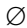Bend $\ldots$ 636

19.29.3.4. $\varnothing$ Pinch $\ldots$ 636

19.29.3.5. $\varnothing$ Reset $\ldots$ 636

19.29.3.6. $\varnothing$ Scaler $\ldots$ 636

19.29.3.7. $\tilde{\otimes}$ Reverse $\ldots$ 636

19.29.3.8. $\varnothing$ Wrap $\ldots$ 636

19.29.3.9. Pitch $\rightarrow\varnothing$ $\ldots$ 636

19.29.3.10. $\varnothing$ Counter $\ldots$ 637

19.29.3.11. $\varnothing$ Formant $\ldots$ 637

19.29.3.12. $\varnothing$ Lag $\ldots$ 637

19.29.3.13. $\varnothing$ Mirror $\ldots$ 637

19.29.3.14. $\varnothing$ Shift $\ldots$ 637

19.29.3.15. $\varnothing$ Sinemod $\ldots$ 637

19.29.3.16. $\varnothing$ Skew $\ldots$ 637

19.29.3.17. $\varnothing$ Sync $\ldots$ 637

19.29.3.18. $\varnothing$ Split $\ldots$ 637

19.29.4. Data Category $\ldots$ 638

19.29.4.1. Accents $\ldots$ 638

19.29.4.2. Gates $\ldots$ 638

19.29.4.3.Pitches $\ldots$ 638

19.29.4.4.Slopes $\ldots$ 638

19.29.4.5. Steps $\ldots$ 639

19.29.4.6. Triggers $\ldots$ 639

19.29.4.7. Probabilities $\ldots$ 639

19.29.4.8. 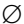  Pulse $\ldots$ 639

19.29.4.9. 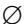 Saw $\ldots$ 639

19.29.4.10. $\varnothing$ Sine $\ldots$ 639

19.29.4.11. 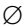  Triangle $\ldots$ 639

19.29.4.12. 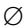  Window $\ldots$ 639

19.29.4.13. Array $\ldots$ 640

19.29.5. Oscillator Category $\ldots$ 640

19.29.5.1 Pulse $\ldots$ 640

19.29.5.2. Sawtooth $\ldots$ 640

19.29.5.3.Sine $\ldots$ 640

19.29.5.4. Triangle $\ldots$ 640

19.29.5.5. Union $\ldots$ 640

19.29.5.6. Wavetable $\ldots$ 640

19.29.5.7. Sub $\ldots$ 642

19.29.5.8.Bite $\ldots$ 642

19.29.5.9 Phase-1 $\ldots$ 643

19.29.5.10. Scrawl $\ldots$ 643

19.29.5.11.Swarm $\ldots$ 644

19.29.5.12. Sampler $\ldots$ 644

19.29.6. Random Category $\ldots$ 644

19.29.6.1. Noise $\ldots$ 644

19.29.6.2.S/H LFO $\ldots$ 644

19.29.6.3. Chance $\ldots$ 644

19.29.6.4.Dice $\ldots$ 645

19.29.7. LFO Category $\ldots$ 645

19.29.7.1.LFO $\ldots$ 645

19.29.7.2. Curves $\ldots$ 645

19.29.7.3. Wavetable LFO $\ldots$ 646

19.29.7.4. Clock $\ldots$ 646

19.29.7.5 Transport $\ldots$ 646

19.29.8. Envelope Category $\ldots$ 646

19.29.8.1.ADSR $\ldots$ 646

19.29.8.2. AD $\ldots$ 647

19.29.8.3.AR $\ldots$ 647

19.29.8.4. Pluck $\ldots$ 647

19.29.8.5. Segments $\ldots$ 647

19.29.8.6. Follower-RF $\ldots$ 649

19.29.8.7.Slope → $\ldots$ 649

19.29.8.8.Slope ↘ $\ldots$ 649

19.29.8.9. Follower $\ldots$ 649

19.29.9. Filter Category $\ldots$ 649

19.29.9.1. Low-pass LD $\ldots$ 650

19.29.9.2 Low-pass MG $\ldots$ 650

19.29.9.3. Sallen-Key $\ldots$ 650

19.29.9.4. SVF $\ldots$ 650

19.29.9.5.XP $\ldots$ 650

19.29.9.6. Comb $\ldots$ 650

19.29.9.7.Vowels $\ldots$ 651

19.29.9.8. Fizz $\ldots$ 653

19.29.9.9. Rasp $\ldots$ 654

19.29.9.10. Ripple $\ldots$ 655

19.29.9.11. All-pass $\ldots$ 656

19.29.9.12. High-pass $\ldots$ 656

19.29.9.13. Low-pass $\ldots$ 656

19.29.9.14. Dome $\ldots$ 656

19.29.10. Shaper Category $\ldots$ 656

19.29.10.1. Chebyshev $\ldots$ 656

19.29.10.2. Distortion $\ldots$ 657

19.29.10.3. Hard Clip $\ldots$ 657

19.29.10.4. Quantizer $\ldots$ 657

19.29.10.5. Wavefolder $\ldots$ 657

19.29.10.6. Diode $\ldots$ 657

19.29.10.7. Rectifier $\ldots$ 657

19.29.10.8.Saturator $\ldots$ 657

19.29.10.9. Transfer $\ldots$ 658

19.29.10.10. Push $\ldots$ 658

19.29.10.11 Heat $\ldots$ 658

19.29.10.12. Soar $\ldots$ 658

19.29.10.13. Howl $\ldots$ 659

19.29.10.14.Shred $\ldots$ 659

19.29.10.15. Curve $\ldots$ 659

19.29.11. Delay/FX Category $\ldots$ 659

19.29.11.1. Delay $\ldots$ 659

19.29.11.2. Long Delay $\ldots$ 659

19.29.11.3. Mod Delay $\ldots$ 659

19.29.11.4. Chorus+ $\ldots$ 659

19.29.11.5. Flanger+ $\ldots$ 660

19.29.11.6. Phaser+ $\ldots$ 660

19.29.11.7. Freq Shift+ $\ldots$ 660

19.29.11.8. Pitch Shift $\ldots$ 661

19.29.11.9. All-pass Delay $\ldots$ 662

19.29.11.10. Recorder $\ldots$ 663

19.29.12. Mix Category $\ldots$ 663

19.29.12.1. Blend $\ldots$ 663

19.29.12.2. Mixer $\ldots$ 663

19.29.12.3. Pan $\ldots$ 663

19.29.12.4. Stereo Width $\ldots$ 663

19.29.12.5.Toggle In $\ldots$ 663

19.29.12.6.Toggle Out $\ldots$ 664

19.29.12.7.Toggle $\ldots$ 664

19.29.12.8. Crossover-2 $\ldots$ 664

19.29.12.9. Crossover-3 $\ldots$ 664

19.29.12.10. Select In $\ldots$ 664

19.29.12.11 Select Out $\ldots$ 665

19.29.12.12. Merge $\ldots$ 665

19.29.12.13.Split $\ldots$ 665

19.29.12.14. LR Gain $\ldots$ 665

19.29.12.15. Stereo Merge $\ldots$ 665

19.29.12.16. Stereo Split $\ldots$ 665

19.29.12.17. Voice Stack Mix $\ldots$ 665

19.29.12.18. Voice Stack Tog $\ldots$ 665

19.29.13.Level Category $\ldots$ 666

19.29.13.1. Level $\ldots$ 666

19.29.13.2. Value $\ldots$ 666

19.29.13.3. Amplify $\ldots$ 666

19.29.13.4. Attenuate $\ldots$ 666

19.29.13.5. Bias $\ldots$ 666

19.29.13.6. Gain - dB $\ldots$ 666

19.29.13.7. Gain - Vol $\ldots$ 666

19.29.13.8. Velo Mult $\ldots$ 666

19.29.13.9. Average $\ldots$ 667

19.29.13.10. Lag $\ldots$ 667

19.29.13.11. Bend $\ldots$ 667

19.29.13.12. Clip $\ldots$ 667

19.29.13.13.Level Scaler $\ldots$ 667

19.29.13.14.Pinch $\ldots$ 667

19.29.13.15. Value Scaler $\ldots$ 667

19.29.13.16.AM/RM $\ldots$ 667

19.29.13.17. Hold $\ldots$ 667

19.29.13.18.Sample/ Hold $\ldots$ 668

19.29.13.19. Shift Register $\ldots$ 668

19.29.13.20.Bi→Uni $\ldots$ 668

19.29.13.21.Uni→Bi $\ldots$ 668

19.29.13.22. Poly→Mono $\ldots$ 668

19.29.14. Pitch Category $\ldots$ 668

19.29.14.1 Pitch $\ldots$ 668

19.29.14.2. October $\ldots$ 669

19.29.14.3. Ratio $\ldots$ 669

19.29.14.4.Transpose $\ldots$ 669

19.29.14.5. Pitch Quantize $\ldots$ 669

19.29.14.6. by Semitone $\ldots$ 669

19.29.14.7. Pitch Buss $\ldots$ 669

19.29.14.8. Pitch Scaler $\ldots$ 669

19.29.14.9. Zero Crossings $\ldots$ 669

19.29.14.10. Freq → Pitch $\ldots$ 670

19.29.14.11. Pitch → Freq $\ldots$ 670

19.29.15. Math Category $\ldots$ 670

19.29.15.1 Constant $\ldots$ 670

19.29.15.2.Invert $\ldots$ 670

19.29.15.3. Reciprocal $\ldots$ 670

19.29.15.4. Add $\ldots$ 670

19.29.15.5.Divide $\ldots$ 670

19.29.15.6. Multiply $\ldots$ 671

19.29.15.7. Subtract $\ldots$ 671

19.29.15.8.Abs $\ldots$ 671

19.29.15.9. Cell $\ldots$ 671

19.29.15.10. Floor $\ldots$ 671

19.29.15.11.MinMax $\ldots$ 671

19.29.15.12. Quantize $\ldots$ 671

19.29.15.13.Round $\ldots$ 671

19.29.15.14. Product $\ldots$ 671

19.29.15.15. Sum $\ldots$ 672

19.29.15.16. Exp $\ldots$ 672

19.29.15.17. Exponents $\ldots$ 672

19.29.15.18. Lin → dB $\ldots$ 672

19.29.15.19. Log $\ldots$ 672

19.29.15.20 Power $\ldots$ 672

19.29.15.21. Roots $\ldots$ 672

19.29.15.22. dB → Lin $\ldots$ 672

19.29.16. Logic Category $\ldots$ 673

19.29.16.1. Button $\ldots$ 673

19.29.16.2. Trigger $\ldots$ 673

19.29.16.3. Clock Divide $\ldots$ 673

19.29.16.4. Clock Quantize $\ldots$ 673

19.29.16.5. Gate Length $\ldots$ 673

19.29.16.6. Gate Repeat $\ldots$ 673

19.29.16.7. Logic Delay $\ldots$ 673

19.29.16.8. Latch $\ldots$ 673

19.29.16.9.N-Latch $\ldots$ 674

19.29.16.10. $\ldots$ 674

$$19.29.16.11.\geq\ldots$ 674$$

19.29.16.12. > $\ldots$ 674

$$19.29.16.13.\leq\ldots$ 674$$

19.29.16.14 < $\ldots$ 674

19.29.16.15. ≠ $\ldots$ 674

19.29.16.16.NOT $\ldots$ 674

19.29.16.17. AND $\ldots$ 674

19.29.16.18. OR $\ldots$ 675

19.29.16.19. XOR $\ldots$ 675

19.29.16.20.NAND $\ldots$ 675

19.29.16.21. NOR $\ldots$ 675

19.29.16.22. XNOR $\ldots$ 675

19.30. Legacy Devices $\ldots$ 675

19.30.1. Audio MOD $\ldots$ 675

19.30.2. LFO MOD $\ldots$ 675

19.30.3. Note MOD $\ldots$ 676

19.30.4. Step MOD $\ldots$ 676

#  0. Welcome to Bitwig Studio

Welcome to Bitwig Studio! We are glad you have joined us and are excited to help you create, compose, polish, and perform your music.

And welcome also to our Bitwig Studio Producer and Bitwig Studio Essentials users! Most of Bitwig Studio's functions and resources are available in all of our products so this user guide applies equally to all programs.

If you are reading this user guide as a web page, the table of contents along with a search function and language selector is available either on the right of this text or at the bottom of this page (hello, mobile interface). And if you are viewing the PDF version, use your program's normal features for browsing sections, searching, etc.

The purpose of this document is to walk you thru most of Bitwig Studio's functions and show you how to operate the program. The chapters and topics are arranged progressively, with basic concepts appearing first and advanced ideas showing up later. And although this document does not attempt to explain fundamental audio and musical concepts, it is written for users of any stripe who want to use software to make music.

In addition to this document, other resources will be mentioned when appropriate, and you can always visit Bitwig's website [http://bitwig.com] for the latest information. And please share any feedback you have or issues you encounter by visiting our support portal [http://bitwig.com/support].

In this chapter, we will begin with links to sections that have changed in this version. We will move on to the Dashboard, which is more or less the command center of Bitwig Studio. Finally, we outline a few conventions that will be used across this document. But you will not make sound in this chapter; that is what the rest of this document is for.

##  0.1. What's New in Bitwig Studio v5.3

For those of you who are recent Bitwig users, hello! Here are some pointers to new and changed sections of this document. New features and some of the updates in Bitwig Studio v5.3 include:

###  The v8 Drum Family

> Ten new instruments, all inspired by classic drum modules but with additional controls, extended ranges, and modern interfaces.

> New drum instrument: v8 Clap (Clap), an instrument inspired by the Hand Clap (CP) of the Roland TR-808 (see section 19.3.2).

> New drum instrument: v8 Claves (Percussion), an instrument inspired by the Claves (CL) of the Roland TR-808 (see section 19.19.2).

> New drum instrument: v8 Cowbell (Percussion), an instrument inspired by the Cow Bell (CB) of the Roland TR-808 (see section 19.19.3).

> New drum instrument: v8 Cymbal (Cymbal), an instrument inspired by the Cymbal (CY) of the Roland TR-808 (see section 19.5.2).

> New drum instrument: v8 Hat (Hi-hat), an instrument inspired by the Hihat elements (CH, OH) of the Roland TR-808 (see section 19.13.3).

> New drum instrument: v8 Kick (Kick), an instrument inspired by the Bass Drum (BD) of the Roland TR-808 (see section 19.14.4).

> New drum instrument: v8 Maracas (Percussion), an instrument inspired by the Maracas (MA) of the Roland TR-808 (see section 19.19.4).

> New drum instrument: v8 Rimshot (Percussion), an instrument inspired by the Rim Shot (RS) of the Roland TR-808 (see section 19.19.5).

> New drum instrument: v8 Snare (Snare), an instrument inspired by the Snare Drum (SD) of the Roland TR-808 (see section 19.22.3).

> New drum instrument: v8 Tom (Tom), an instrument inspired by the Tom Tom elements (LT, MT, HT) of the Roland TR-808 (see section 19.26.3).

#  The v9 Drum Family

> Nine new instruments, all inspired by classic drum modules but with additional controls, extended ranges, and modern interfaces.

> New drum instrument: v9 Clap (Clap), an instrument inspired by the Hand Clap (CP) of the Roland TR-909 (see section 19.3.3).

> New drum instrument: v9 Crash (Cymbal), an instrument inspired by the Crash Cymbal (CY) of the Roland TR-909 (see section 19.5.3).

> New drum instrument: v9 Hat Closed (Hi-hat), an instrument inspired by the Closed Hi Hat (CH) of the Roland TR-909 (see section 19.13.4).

> New drum instrument: v9 Hat Open (Hi-hat), an instrument inspired by the Open Hi Hat (OH) of the Roland TR-909 (see section 19.13.5).

> New drum instrument: v9 Kick (Kick), an instrument inspired by the Bass Drum (BD) of the Roland TR-909 (see section 19.14.5).

> New drum instrument: v9 Ride (Cymbal), an instrument inspired by the Ride Cymbal (CY) of the Roland TR-909 (see section 19.5.4).

> New drum instrument: v9 Rimshot (Percussion), an instrument inspired by the Rim Shot (RS) of the Roland TR-909 (see section 19.19.6).

> New drum instrument: v9 Snare (Snare), an instrument inspired by the Snare Drum (SD) of the Roland TR-909 (see section 19.22.4).

> New drum instrument: v9 Tom (Tom), an instrument inspired by the Tom Tom elements (LT, MT, HT) of the Roland TR-909 (see section 19.26.4).

#  The vO Drum Family

> Six original instruments, using detuned oscillator banks, FM, filter banks that are sometimes harmonic, and even physical models.

> New drum instrument: vO Cymbal (Cymbal), a hybrid cymbal instrument (see section 19.5.1).

> New drum instrument: vO Hat (Hi-hat), a hybrid hi-hat instrument (see section 19.13.1).

> New drum instrument: v0 Kick (Kick), a hybrid kick drum instrument (see section 19.14.1).

> New drum instrument: vO Snare (Snare), a hybrid snare drum instrument (see section 19.22.1).

> New drum instrument: vO Tom (Tom), a hybrid tom tom instrument (see section 19.26.1).

> New drum instrument: vO Zap Kick (Kick), a psy-inspired kick drum instrument (see section 19.14.2).

#  Stepwise, a generative note effect / sequencer

> New note sequencer device: Stepwise (Note FX), a playful, eight-row step sequencer that outputs notes while the global transport is playing (see section 19.17.19).

> Related features make it easy to use multiple Stepwise devices, or note-generating Note Grid patches:

Stepwise passes any incoming notes thru, so multiple devices can be placed in a row for additional sequencer rows.

Note FX Selector (Container) now has a Solo Active Layer option, overriding the normal selector behavior and activating only layer at a

time (see section 19.4.10). This is good for switching between multiple Stepwise devices, for different patterns or variations.

> To isolate individual rows of Stepwise, the Use MIDI Channels parameter can be turned on in the Inspector Panel. Note streams can them be separated in various ways, such as:

By adding a Channel-16 (Note-driven) modulator on a following instrument or device (see section 19.28.6.1).

Grid module: Note In (I/O) now has a MIDI Channel(s) parameter, to have a module only receive notes from a single channel, easily splitting note streams in any Grid patch (see section 19.29.1.13).

By using the Note FX Layer device to segregate each row to its own chain. For example, see the factory preset "by MIDI Channel", which breaks apart a single note stream and offers individual note processing chains for each MIDI channel.

> Related technology is now available in The Grid:

New Grid module: Step Access (Phase), a transport-relative phase signal generator (always relative to bar 1 beat 1, like Stepwise), for reaching particular step ranges within data sequencers (see section 19.29.3.2).

New Grid module: Accents (Data), a tri-state event sequencer, with separate out ports for Normal and Accent events (see section 19.29.4.1).

#  Master Recording for New Workflows

> The new Master Recording feature offers new possibilities and workflows (see section 14.6).

> The master track's level meters are always visible now along with Master Recording controls in the display section of the transport area (see section 2.3.3).

> Since it is independent of the global transport, you can now continuously record audio while retriggering or jumping the playhead. Or you can record audio without ever pressing play in the transport. After recording, you can preview or drop in the new audio — even to a Sampler or Convolution device — without interrupting the transport.

#  New Ways to Shift Audio

> New audio FX device: Freq Shifter+ (Audio FX), an analog-style frequency shifter, with optional delay network and much more (see section 19.2.2).

> New Grid module: Freq Shift+ (Delay/FX), a module version of the Freq Shifter+ device, with optional polyphony, stereo signal-rate control, and a special Keytrack mode (see section 19.29.11.7).

> New Grid module: Pitch Shift (Delay/FX), a pitch-transposing module, with keytracking, grain control, and the ability to phase modulate any signal, etc. (see section 19.29.11.8).

> Related technology now available in The Grid:

New Grid module: Dome (Filter), provides any signal's real and imaginary portions, as well as its magnitude and phase (see section 19.29.9.14).

#  Audio System Overhaul

> Audio devices can be set up in a more consistent way, with options to hide or favorite ports for program-wide choosers (see section 0.2.2.2).

> Multiple audio interfaces can now be part of a Combined Audio Device, made within Bitwig Studio on macOS and Linux (see section 7.3.2).

> When new audio interfaces are found, they can be directly switched to via notification (see section 0.2.2.2).

> Audio interface switching now happens more quickly, keeping the engine alive whenever possible.

> Audio interface ports are now automatically configured, when possible.

> New special configurations are available, such as System Out to follow the OS-selected output, and System In + Out to follow the OS-chosen output and input.

> Multiple speakers can now be enabled at once from the Output Monitoring Panel (see section 7.3.2).

#  Other new things include:

> Projects and presets now load faster on all computers, and subsequent loads are even faster because of optimized caching.

> New Grid module: CV Pitch In (I/O), a specialized input module, with DC and AC modes, as well as Octave Range, Root Key, and Smoothing parameters (see section 19.29.1.20).

> The Bounce function now has an In-Place toggle, allowing full configuration of the Bounce In Place function (see section 13.2.1).

> Additional Bounce In Place functions have been added, with the original function – renamed Bounce In Place (Pre-FX) – joined by Bounce In Place (Pre-Fader) and Bounce In Place (Post-Fader).

> Various Audio Import settings have been adjusted (see section 0.2.2.1).

> The original E- drum family is now renamed as the v1 family, so:

E-Clap (Clap) is now v1 Clap (see section 19.3.1).

E-Cowbell (Percussion) is now v1 Cowbell (see section 19.19.1).

E-Hat (Hi-hat) is now v1 Hat (see section 19.13.2).

E-Kick (Kick) is now v1 Kick (see section 19.14.3).

E-Snare (Snare) is now v1 Snare (see section 19.22.2).

E-Tom (Tom) is now v1 Tom (see section 19.26.2).

#  0.2. The Dashboard

Once you have Bitwig Studio installed and launched, the first place you will land is a place you will return to again and again. The Dashboard is a central hub for finding your projects, configuring your settings, managing library content, and accessing help. Each of these four tasks has its own tab for navigation, and we will walk thru each of them in turn in the following sections.

##  ① Note

If Bitwig Studio opens to a different view, you can call up the Dashboard at any time by clicking the Bitwig logo in the center of the window's header, at the very top of the screen.

###  0.2.1. User Tab

We call the first tab of the Dashboard the user tab because it displays the name you have registered with Bitwig. (If your username is too long, it will simply display User.)

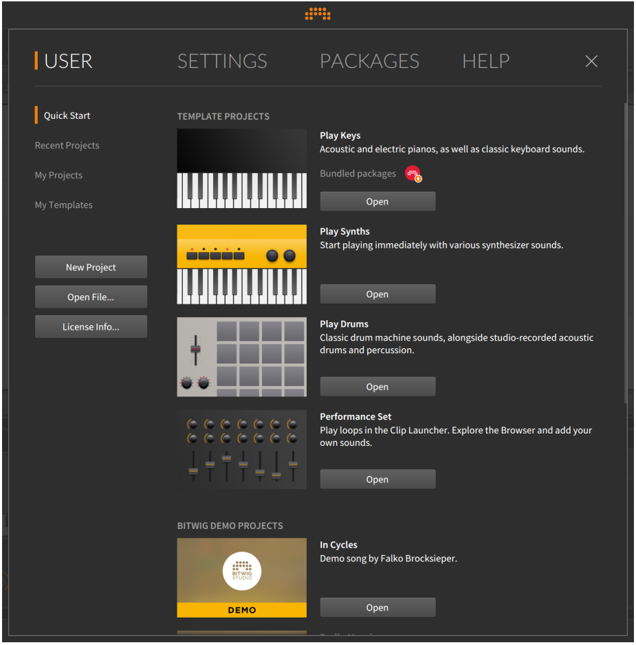

The Quick Start page shows both Template Projects (that work as starting points) and demo project made either by Bitwig (found under Bitwig Demo Projects) and our partners (under Partner Demo Projects). Each demo project provides a short write-up, a list of any Bundled packages that are required to run it, and an Open button. Clicking Open downloads the project along with any used packages (which requires an internet connection), and then opens the project.

The next three pages show local content and are similar in format. The Recent Projects page shows the Bitwig Studio projects you have opened lately. The My Projects page displays all projects found in the My Projects path (which is defined in the Settings tab within the Locations page), and the My Templates page shows any template projects that you have saved.

Each of these three pages shows content in the same way. A search bar is provided at the top of the project list for winnowing down the projects being shown. When a project is selected (by single-clicking it), project information is display at the bottom of the window. This includes entries such as the last modification time and the file path to the project folder.

To open a listed project: either click the respective Open button or double-click the project name.

Finally, every page under the user tab shares three buttons on the middle left:

> New Project creates a blank project to let you begin working from scratch.

> Open File... provides a standard open dialog, in case you prefer locating a project that way.

> License Info... opens a window that displays your local license data and provides an option for registering a new serial number.

Because exiting the Dashboard requires that you have a project file open, trying to leave the Dashboard with no project open will send you to the User tab. The New Project button politely flashes in this case, indicating the quickest way to exit the Dashboard and get to work.

#  0.2.2. Settings Tab

The Settings tab is where Bitwig Studio's preferences generally live. We will look at a few of these pages in detail and then take the rest in the order that they appear.

##  0.2.2.1. Behavior Settings

The Behavior page offers several workflow settings. This includes a block of Defaults, such as the New track volume to use. It also includes audio stretching defaults, for cases when Import / processing audio, and for times when Record / bounce have created new content. A little lower down is the Exclusive Solo option. When on, enabling any track's solo button will automatically disable all others. (And whichever solo behavior you prefer, hold [SHIFT] when clicking a solo button to use the opposite behavior.)

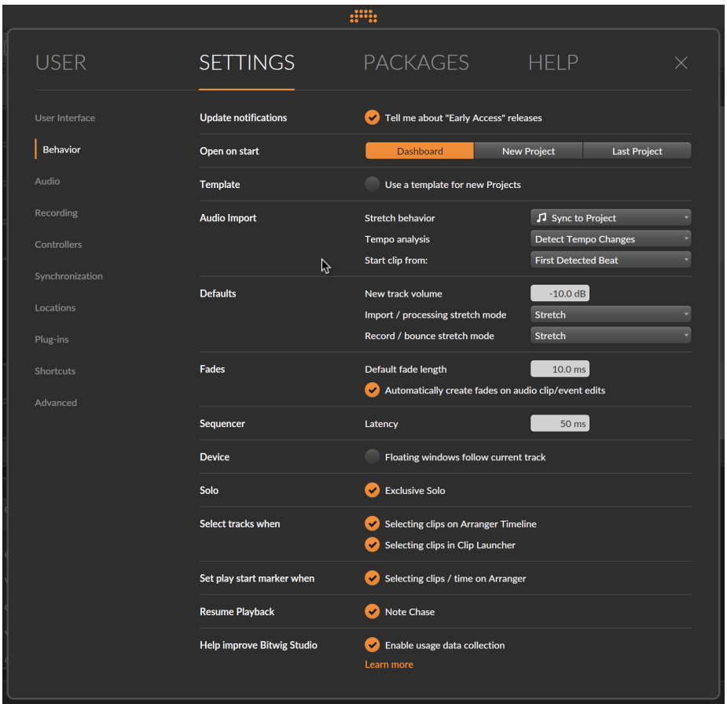

Worth noting here is the Audio Import block, which determines the way that incoming audio samples are analyzed and prepared, particularly with regard to tempo. There are three parameters.

Stretch behavior is available here. It is also available within the preview player of Bitwig's browsers, as this setting influences audio preview behavior as well (see section 4.2.4.1). Three options are available.

> Sync to Project will stretch imported audio to align with the project tempo (including any tempo changes).

> Original speed [neutral] will insert the audio with stretching enabled, but it will be set to play neutrally. Then if you do change the project tempo later, the audio will follow and keep its relationship to the groove.

> Original speed [Raw] will never change speed.

#  ① Note

Stretch behavior acts as the default for audio that is dragged into a project, either from the Browser Panel or from your operating system's file manager. But you may wish to handle different material with different settings. So while audio is being dragged into the project, the window footer will offer modifier keys for using the alternative modes.

Tempo analysis sets how incoming audio files will be analyzed. When set to Detect Tempo Changes, the program will decide whether the audio should be treated as fixed-tempo material (as are many tracks made on the computer), or to insert matching beat markers for any detected tempo changes (which are more common in live recordings). Or you can instruct the program to Assume Fixed Tempo, in case that better suits your audio library.

Finally, the Start clip from: parameter determines the alignment of clips created when audio is dragged in. The easy choice is Sample Start, which simply starts news clip at the beginning of the audio file. Or you can choose to start on the First Detected Beat, which makes use of the program's beat detection.

This page also offers general settings, such as what to Open on start, whether a Template project should be used whenever you create a new project, and whether you want to be told about "Early Access" releases.

#  0.2.2.2. Audio Settings, and Combined Audio Devices

The Audio page sets parameters necessary for audio operation.

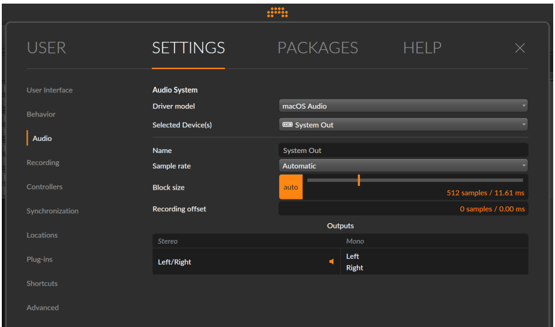

To configure your audio hardware for the first time, begin by selecting the proper Driver model for your interface. The options available here vary based on your platform. If you are unsure of what to set, try the first option available.

Next, choose a Selected Device(s). In some cases (as in the image above), a System Out option will be available, which will follow whatever audio output is being used by your operating system. But directly selecting a device is always possible from the menu. And when an audio interface is recognized by the program, a notification will appear.

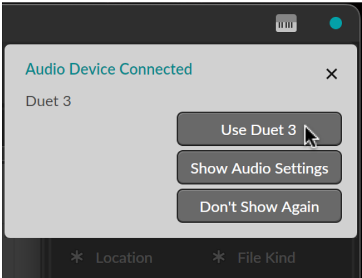

Whatever Selected Device(s) are chosen, their Sample rate and Block size settings can set directly, or left in special Automatic (or auto) settings.

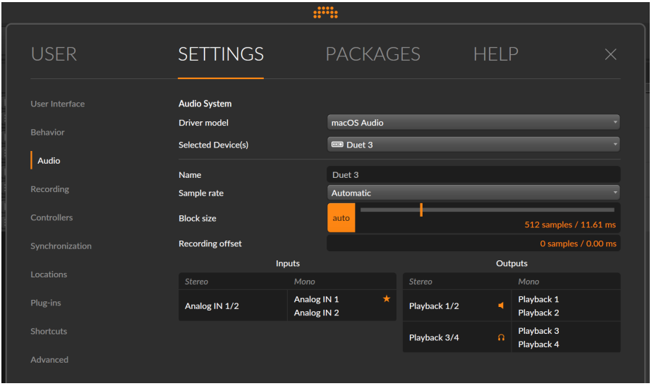

When Automatic settings are used, Bitwig Studio will act to minimize audio interruptions by preserving the current settings (if possible) when switching to a different audio interface.

Any device's Inputs and Outputs are available (both as Mono paths as well as logical Stereopairs). All of these routings can be used as is, or you can configure them additionally.

To rename an audio port or buss: double-click on the name, and then enter your preferred name. (If you want to revert to the provided name, you can delete the current name and then press [ENTER].)

When hovering over any Stereo or Mono routing, additional icons will appear.

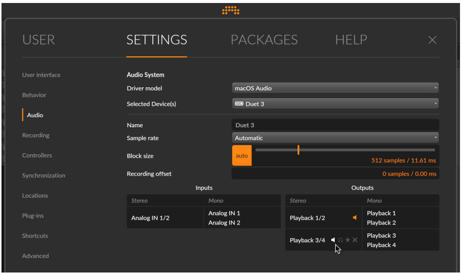

Stereo output ports (as shown above) include choices for defining that buss's role.

> Clicking the speaker icon defines this port as Speakers. (The first stereo output of any device is usually assumed to be speakers and set accordingly.)

> Clicking the headphones icon defines this port as Headphones.

These roles are used in the Output Monitoring Panel (see section 7.3.2), but all ports will be available from audio output choosers thru out the program.

The last two icons shown above are menu management options, and they are available for all port types.

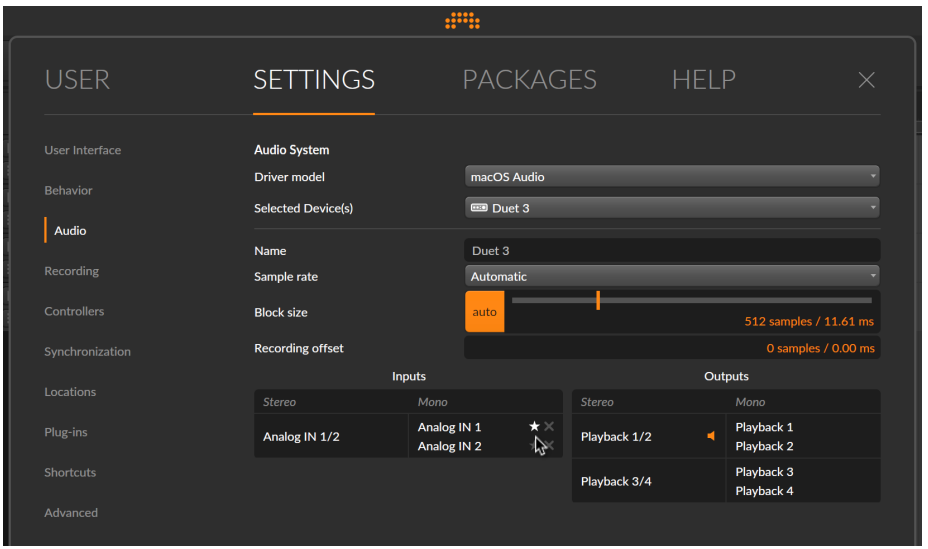

> Clicking the star icon marks this port as a favorite. This will list the port at the top level of relevant choosers.

> Clicking the x icon will hide this buss in program routing choosers.

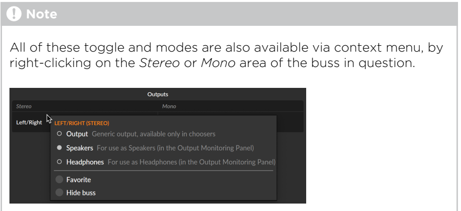

Additionally, macOS and Linux allow creating a Combined Audio Device directly from Bitwig Studio. This allows you to use multiple audio interfaces or virtual audio drivers at the same time.

To create a Combined Audio Device: click on the Selected Device(s) menu, and choose the final option, Create new Combined Device.

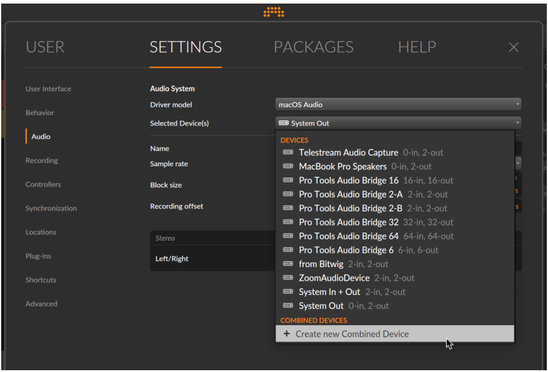

This will create a new Combined Audio Device, immediately offering a list of available devices.

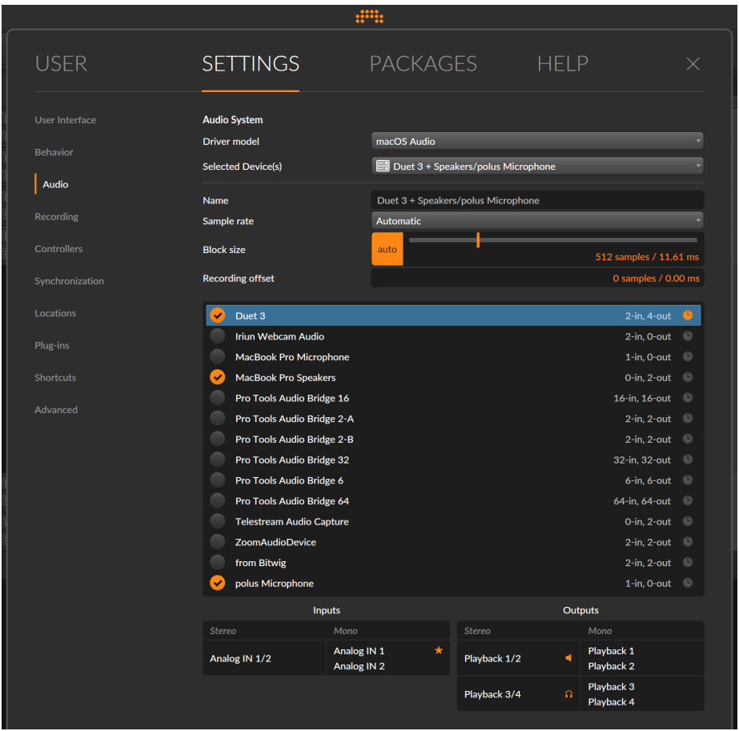

Checking any device here will include it in the Combined Audio Device. Clicking the clock icon sets that device as the group's clock master. And to get the configuration options for any particular device, simply select it to expose its Inputs and Outputs below.

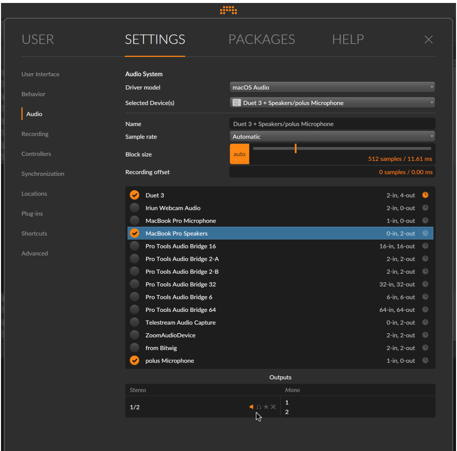

#  0.2.2.3. Controllers Settings

The Controllers page allows you to designate and configure any MIDI controllers that you will be using with Bitwig Studio.

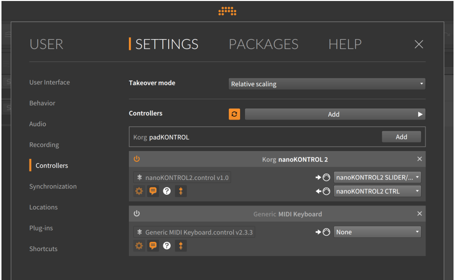

The global Takeover mode setting determines how individual controls and their associate software parameters interact before their values match. Options include:

> Immediate, which fully applies any control message to its software parameter, moving it immediately.

> Catch, which waits to move the software parameter until the control message matches or passes the current parameter value.

> Relative scaling, which moves the software parameter incrementally in the same direction that the control is moving (for example, turning a knob up increases the parameter value, while turning a knob down decreases the value). This creates a relative motion based on your control gestures that will gradually meet the parameter value.

In the Controllers sections, the top row represents ways of adding controllers to your setup. The toggle with circular arrows represents auto-add mode. Enabled by default, this mode will automatically add any detected controller to your Bitwig Studio setup if a device-specific controller extension is also found.

The Add button allows you to add controllers manually. Clicking it calls up a menu of various controller manufacturers, each containing a submenu of models. If you do not find your device here, you can choose the top menu item, labeled Generic, and select the model best approximating your controller. Choices include:

> Keyboard + 8 Device Knobs (CC 20-27), which is useful for a device with eight controllers that use continuous controller (CC) numbers 20 thru 27. These CCs are then used for soft control mappings.

> MIDI Keyboard, which is useful for a keyboard controller that you plan to use as a note input device. When specifying the source of MIDI/ note messages via an input chooser, you can select all incoming MIDI channels (the default), or you can specify one MIDI channel to listen to.

As shown in the above image with the Korg padControl entry, you may see one or more unfilled rectangles with an Add button at the right. These entries appear when a controller that was previously setup and then manually deleted has been recognized by the computer. Since auto-add is not available in these cases, the manual Add button is here to let you quickly restore the device.

Below this top line are entries for individual controllers that are configured, usually named in their title bar with the controller manufacturer and the name of the extension (often matching the controller model). The "power" toggle at the title bar's left edge allows you to disable messages from the controller and extension without removing it. And the x icon at the right is for deleting the controller altogether.

Just below the title bar is a puzzle piece icon with the name of the controller extension (or extension) following it. In the case that you have multiple extensions on your computer that work with this controller, this line becomes a menu, allowing you to swap one extension for another.

On the right side of each entry are menus for MIDI input and output ports (respectively) that the controller extension requires. If a device has gone offline or been disconnected, these ports may need to be set again before the power toggle can be enabled.

Finally, the bottom left of each entry contains a row of buttons related to the controller's performance (see section 15.2).

#  0.2.2.4. Synchronization Settings

The Synchronization page provides options for both controlling Bitwig Studio from external sources and for transmitting messages to synchronize other platforms/hardware to Bitwig.

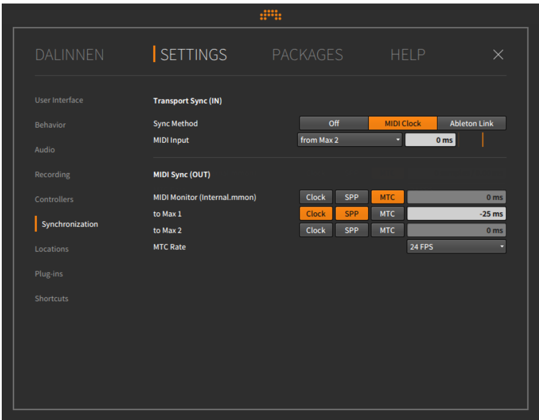

The Transport Sync (IN) section allows you to select the Sync Method in use. The following three options are available:

> Bitwig Studio's Internal mode keeps the program's clock and transport independent from the outside world.

> The MIDI Clock mode synchronizes Bitwig Studio's clock to incoming MIDI clock messages from a selected MIDI Input port. For better synchronization, the MIDI Input signal can be shifted positively (to play a bit earlier) or negatively (pushing it later, into the future) in milliseconds.

Additionally, a vertical orange slider at the far right sets the responsiveness of Bitwig Studio to incoming tempo changes. Moving the slider to the left results in a quicker response to new tempo messages. Moving the slider to the right results is a more gentle response, which can be helpful when the tempo is largely static or the hardware in question is resulting in jittery behavior.

> Ableton Link connects Bitwig Studio to any and all other programs and devices on your local network that use Ableton's Link technology. (Compatible software running on your own machine alongside Bitwig Studio will be automatically found as well and can be synchronized in the same fashion.)

#  ① Note

A list of applications and devices that support Link can be found on this web page [https://www.ableton.com/en/link/apps/]. For additional information and support for these other products, visit the appropriate manufacturer's website or support center.

Link acts as a global time keeper, keeping track of and sharing the latest tempo and relative bar position for all "participants" (each application and device) in a "Link session." The rules are fairly simple:

1. When a new participant joins a Link session, its local tempo will automatically be set to the Link session's current tempo.

2. When a participant's transport is started, playback will wait until the Link session's relative bar position matches the participant's starting point. So if you hit play on a participant's transport from the top of bar one, the transport will wait for the Link session to arrive at the beginning of the next bar, thereby keeping everyone in relative sync.

3. When the tempo of any participant changes, the Link session's tempo is updated, and each participant's local tempo is automatically changed as well.

#  ① Note

A general troubleshooting Q&A on Link can be found on this web page [https://help.ableton.com/hc/en-us/articles/209073069-Link-Troubleshooting] from Ableton.

Finally, both the MIDI Clock and Ableton Link options add a dedicated button to the Bitwig Studio window, between the transport and display sections of the menu/transport area (see section 2.3). These buttons allow you to toggle the selected sync method on and off on the fly, and the Link button also reflects the number of other participants in the current Link session.

The MIDI Sync (OUT) section lets you set for each output path whether to:

> Enable MIDI Clock (the time clock icon)

> Enable MIDI Clock Start/Stop messages (the play triangle icon; available if MIDI clock is enabled)

> Always send MIDI Clock, even when the transport is stopped (the lock icon; available if MIDI clock is enabled)

> Enable SPP (MIDI song position pointers; available if MIDI clock is enabled)

> Enable MTC (MIDI timecode)

And similar to the MIDI Input offset value, a MIDI Out Clock Offset can be set to fine tune each outgoing path separately. And a global setting for the MTC Rate can be set here as well.

#  0.2.2.5. Shortcuts Settings

The Shortcuts page allows the reconfiguration of Bitwig Studio's keyboard commands and the use of MIDI controller mappings to trigger these commands.

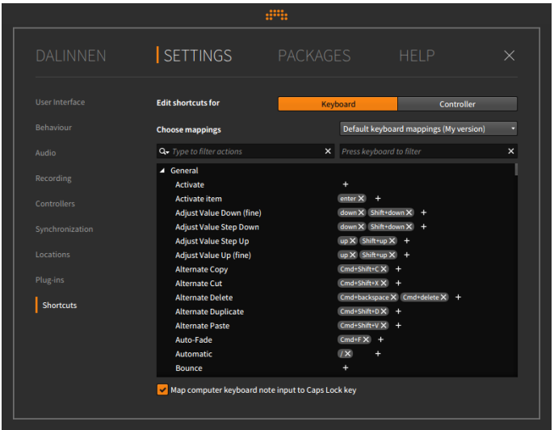

On this page, you can Edit shortcuts for both the computer Keyboard and via MIDI Controller.

To define a command mapping: locate the command you wish to map, and then click the + button to the far right of the command. You will then be prompted to trigger the desired mapping.

As can be seen in the image above, multiple mappings can be defined for each command.

To remove a command mapping: click the x button at the right of the mapping.

Once settings have been adjusted, the Choose mappings menu becomes a text entry box where new mapping sets can be named and a Save button appears.

#  ① Note

When this manual refers to keyboard shortcuts, it is referencing the program's default shortcuts. Once you begin using your own shortcuts, the shortcuts in this document may be inaccurate for your use.

#  0.2.2.6. Other Settings

All other pages of the Settings tab are listed here in order.

> User Interface houses settings that visually alter Bitwig Studio. This starts with the Language chooser.

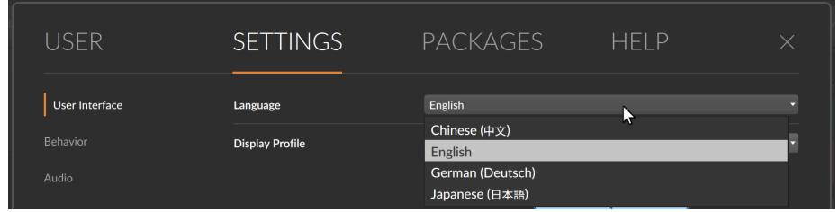

Device and parameters are still shown with their proper names, but most functions, labels, and Interactive Help (for the 300+ devices and modules) are translated to the language selected.

This page also includes the selected Display Profile, the program's Scaling level for each display in use, Contrast settings for getting the interface to look its best, the Playhead follow mode for how the window scrolls, and whether timeline audio's Waveform display is shown on a Perceptual scale or not.

> Recording provides general Recording settings, what type of tracks Auto-Arm when selected, the amount of Pre-Roll use (and whether the metronome is activated for that period), and the amount (if any) of Record Quantization to be used on notes.

> Locations defines several paths for Bitwig Studio, such as where My Projects live, where My Library is stored, where My Controller Scripts should be saved, and a number of other locations for the browsers to use.

The section for Plug-in Locations includes folders to be scanned for valid audio plug-ins, but it also contains preferences for which format(s) should be displayed when a plug-in is located in multiple formats.

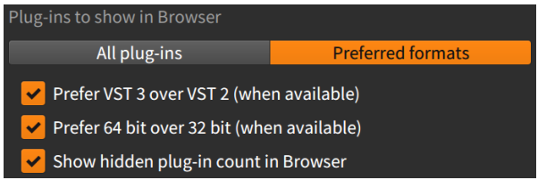

When you have selected to show All plug-ins, the following options are irrelevant and dimmed. When Preferred formats is selected, the options below take effect:

Prefer CLAP over VST (when available) - When both a CLAP and VST version of the same plug-in are found (and can be matched), this option will hide the VST version by default.

Prefer VST 3 over VST 2 (when available) - When both a VST 3 and VST 2 version of the same plug-in are found, this option will hide the VST 2 version by default.

Prefer 64 bit over 32 bit (when available) - When both a 64-bit and 32-bit version of the same plug-in are found, this option will hide the 32-bit version by default.

Prefer native over emulated Intel on Rosetta (when available) - For Mac ARM, when both a native ARM and Intel version of the same plug-in are found, this option will hide the Intel version by default.

> Plug-ins provides options for how third party audio plug-ins are shown and handled. For more information, see section 16.3.

#  0.2.3. Packages Tab

The Packages tab is where supported library contents can be managed, downloaded, and updated from Bitwig.

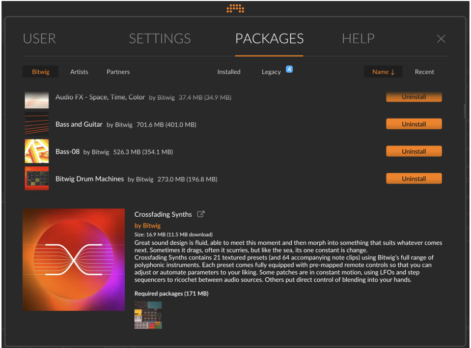

Click on any package results in additional information popping up, as seen above. Otherwise, the top row of text buttons represents view filters for seeing and sorting packs differently.

The first group of buttons offers to filter packages by their source, either by showing only those by Bitwig, only those by Artists, or only those from Partners (like sound design companies, etc.). Or simply turn off this filter to see packages from all sources.

The second group of buttons offers to filter packages by their status within you library, by either showing only the packages you have already Installed (meaning their content is available to use), or just showing the packages that aren't installed but are Available. Or, again, simply turn off this filter to see all packages in the list below.

Finally, the third group offers sort options. One option is to sort packages alphabetically with the Name ↓ button. Or choose to sort packages based on their release date with the Recent button.

#  0.2.4. Help Tab

The Help tab provides links to documentation and resources both within the application package and online.

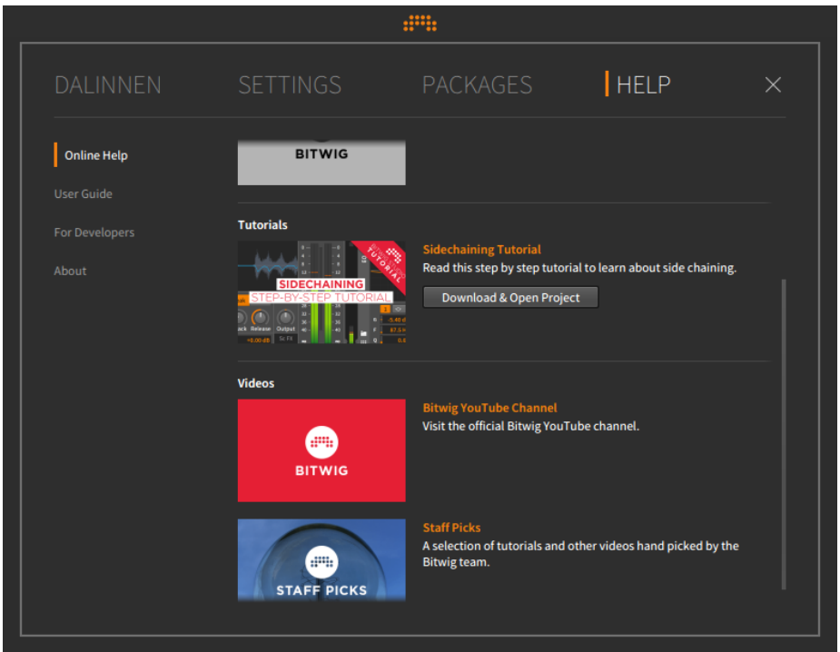

Again, several pages exist within this tab:

> Online Help offers information about various resources, as well as either links to the online content or the option to Download & Open Project.

> User Guide provides links to this document in all available languages.

> For Developers contains links to various guide and references documents and other on-board tools.

> About presents the version of this Bitwig Studio installation. It may be useful for bug reporting, etc.

#  0.3. Document Conventions

Here are a few notes on the formatting of this document, particularly in relation to the platform you may be using:

> Whenever key commands are the same for Windows, OS X, and Linux, the command will be listed once without any comment. When the key command is different for the platforms, the Windows/Linux version will be listed first, and the Mac version will follow and be labeled. An

example for the copy function would be: press [CTRL]+[C] ([CMD]+[C] on Mac).

> If you are on a Mac, your [ALT] key might be labeled "option." In this document, it will always be called [ALT].

> If you are on a Mac, your "command" key might be labeled with an apple icon. In this document, it will always be called [CMD].

> If you are on a Mac, right-clicking can also be achieved by [CTRL]-clicking.

> Screenshots in this document were made with the Mac version of Bitwig Studio.

#  1. Bitwig Studio Concepts

This chapter is both an introduction to the program and an overview of its structure. Please start here to get acquainted with the fundamental concepts and related vocabulary used in Bitwig Studio.

##  1.1. Top-Level Concepts

Bitwig Studio is a modern digital audio workstation (DAW) that allows you to seamlessly compose, produce, perform, and expand your music.

A file created in Bitwig Studio is called a project. You can have multiple projects open at once, but audio will be active for only one of these projects at a time.

Bitwig Studio projects are organized into tracks, which can be thought of as either individual instruments or layers that should be handled similarly. Each track contains a signal path that results in audio and has common mixing board controls (such as volume, panning, solo, and mute).

Clips are containers for individual musical ideas. Clips store either notes or audio, as well as control and automation data.

Music is made in Bitwig Studio by creating a project and populating its tracks with clips, which you can then refine, arrange, and trigger.

##  1.2. A Matter of Timing

As Bitwig Studio's primary task is to record and play back music, the element of time is crucial. The transport (most closely associated with the global play, stop, and record buttons) is the engine that drives all time functions in Bitwig Studio. This means that for any clip(s) to be played back, triggered or recorded, the transport must be active, propelling the Global Playhead forward.

Bitwig Studio works with time in musical units of bars, beats, and ticks (a set subdivision, which defaults to sixteenth notes). A final value is stored for finer resolution, which is a rounded percentage of the distance between the current tick and the next one. These four units are shown together with period spacers in this way: BARs.BEATs.TICKs.‰

For example, with a default time signature setting of 4/4, 1.3.4.50 would represent an event happening in the first bar, on the third beat, within

the fourth sixteenth note, exactly halfway to the next sixteenth note. The example below uses Bitwig Studio's counting system to label a rhythm in traditional musical notation:

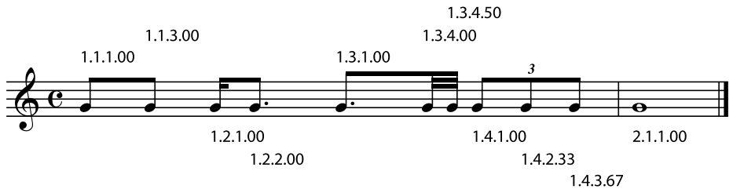

#  1.3. One DAW, Two Sequencers

Within Bitwig Studio are two independent sequencers:

> The Arranger Timeline (or Arranger) is a linear sequencer that operates across a standard musical timeline. This is the place for sketching and producing full-length songs or other works.

> The Clip Launcher (or Launcher) is a nonlinear sequencer where you can accumulate a bank of musical ideas and then mix and match them. Clips in the Launcher can be organized into groups called scenes, either for triggering those clips together or for composing in blocks (such as verse, chorus, bridge, etc.).

The Arranger Timeline and Clip Launcher contain completely separate data. Editing clips on the Arranger Timeline has no effect on those stored in the Clip Launcher, and vice versa. But the Arranger Timeline and Clip Launcher do interact in several critical ways:

> Clips can be freely copied between the Arranger Timeline and Clip Launcher. When selected together, multiple clips can also be copied back and forth, and scenes can as well.

> The result of all triggered Launcher clips can be recorded directly to each Arranger track, allowing you to capture an improvisation that can be edited later.

> Except when recording the Clip Launcher's output to the Arranger Timeline, only one of these two sequencers is active at any given time. So on a track-by-track basis, you choose whether the Arranger Timeline or Clip Launcher is in control and can trigger its data.

> By default, the Arranger Timeline is the active sequencer for each track.

> Each track can play only one clip at a time.

#  1.4. Devices, Modulators, and Other Signal Achievements

Devices are special-function components that extend your signal paths by modifying or transforming incoming notes or audio signals.

Every track has a device chain. In terms of signal flow, this device chain falls between the incoming sequencer data and the track's mixing board section. In this device chain you can insert as many devices as you like. You can even use Bitwig's devices to create additional device chains.

Each device has parameters, which are settings that determine how that device operates. Parameters are set directly within the device's interface or via an assigned MIDI controller. Parameter values can also be sequenced via automation, adjusted via the device's remote controls, or manipulated by modulators, which are special-purpose modules that can be loaded within any device — or onto any track for control of all its contained devices and mixer controls.

Devices are grouped into several descriptive categories, including these:

> Analysis. Devices that merely visualize the signals that reach them. They make no effect on the audio chain they are a part of.

> Audio FX. Devices that manipulate incoming audio signals before passing them onward.

> Container. Utility devices whose primarily function is to host other devices.

> Delay. Delay line-based processors that operate on their incoming audio signals.

> Distortion. Shapers and other mangling processors that operate on their incoming audio signals.

> Dynamic. Processors that operate on their incoming audio signals, based off of those signals' amplitude levels and trends.

> EQ. Sets of frequency-specific processors that operate on their incoming audio signals.

> Filter. Frequency-specific processors that operate on their incoming audio signals.

> Hardware. Interface objects for sending signals and/or messages to devices beyond Bitwig Studio (such as hardware synthesizers and effect units, etc.). This can include transmitting and/or receiving audio signals, control voltage (CV) signals, and clock messages.

> MIDI. Transmitters for sending various MIDI messages via the track's device chain. This is useful for sending messages to plug-ins or to external hardware (when used in conjunction with Bitwig's hardware devices).

> Modulation. Processors that manipulate incoming audio signals with an LFO, etc. influencing their function.

> Note FX. Devices that generate or manipulate incoming note messages before passing them onward.

> Reverb. Time-based processors that operate on their incoming audio signals.

> Routing. Devices that divert a track's signal path, allowing signals to exit and/or reenter the track.

> Spectral. Devices that operate in the frequency domain, working with hundreds of individual frequency bands.

> Synth. Synthesizer instruments that either generate their audio from rudimentary source material or use audio samples. Incoming note messages are used to synthesize audio.

> The Grid. Devices utilizing The Grid, Bitwig's modular sound-design environment (see chapter 17).

> Utility. An assortment of devices sporting various generating, processing, and time-shifting functionality.

All device chains in Bitwig Studio support both audio and note signals. To keep these signals accessible, a few rules apply.

> Except for note FX devices, all devices receiving note signals pass them directly to their output. (Note FX process the incoming notes before passing them onward.)

> Except for audio FX devices, all devices receiving audio signals pass them to their output. (Audio FX process the incoming audio before passing them onward.)

> Many Bitwig devices possess a Mix parameter. Similar to a "wet/dry" fader, this control blends the raw audio that entered the device into the device's output.

In Bitwig Studio, all audio signal paths are stereo.

#  1.5. A Musical Swiss Army Knife

Bitwig Studio's various viewers and editors are called panel/s. These panels are the heart of the program and the places where all work happens.

The Arranger Timeline Panel lets you see all of your project's tracks, create an arrangement with timeline clips, and edit track automation.

The Clip Launcher Panel allows you to trigger clips both freely and in sync with the transport, copy clips into and out of the Arranger, and sort clips into scenes.

i The Inspector Panel displays all parameters for any selected clips, notes, audio events, or tracks (and modulation parameters for any selected devices).

The Detail Editor Panel is the graphical editor for both notes and audio, and their affiliated data.

♞ The Automation Editor Panel gives you detailed control over track automation, clip automation, and MIDI control messages.

☐ The Device Panel shows the full device chain for the selected track, including an interface for each Bitwig device and VST plug-in in use.

The Mixer Panel presents the channel strip for each track and any subsidiary signal chains.

Q The Browser Panel allows you to preview, load, save, and tag content from your Bitwig Studio library and elsewhere on your machine.

▶ The Project Panel manages your project's metadata, gives access to all Arranger cue markers and Launcher scenes, and shows the status of files and plug-ins being used.

The Output Monitoring Panel gives audio control options, such as routing the main audio buss to any pairs of speakers and headphones, solo and cue behaviors, etc.

The Mappings Browser Panel allows you to make and edit project-specific connections of your computer keyboard and/or MIDI controller(s) to your project's parameters.

The On-screen Keyboard Panel provides visualizations of the selected track's playing and incoming note messages, pitch expressions, and timbre expressions, as well as an input method for these data streams.

The primary interfaces in Bitwig Studio are called views. Each view gives you access to a set of panels chosen to help you carry out a particular musical job.

> The Arrange View lets you focus on assembling music, particularly by recording and ordering clips. The Arranger Timeline Panel is central to this view along with the optional Clip Launcher Panel. All panels are available here, and all project tracks are viewed together.

> The Mix View focuses on mixing tracks and triggering clips. The Mixer Panel is central to this view along with the optional Clip Launcher Panel. Except for the Arranger Timeline Panel, all other panels are available here, and all project tracks are viewed together.

> The Edit View is for making detail edits to clips. The Detail Editor Panel is central to this view along with the optional Automation Editor Panel. Except for the Arranger Timeline and Clip Launcher panels, all other panels are available here.

When working in any of the timeline editors, Bitwig Studio has two ways of making a selection. Each method has its own unique functions and keyboard workflows, so it is also possible to Switch between selection kinds in the Edit menu.

> Object selection starts with choosing one or more timeline objects (such as clips, audio events, note events, expression points, or automation points). This is usually achieved by clicking objects with the Pointer tool. The computer keyboard's arrow keys default to whatever makes sense in each particular case — for making selection (with clips and points), or for moving events (with notes and audio events) — but the alternate case is available via the [ALT] key.

> Time selection captures any events (or partial events) within a span of time. This is usually achieved with the Time Selection tool. Clicking

into an editor with this tool selects a single moment of time, which then allows the computer keyboard's arrow keys to jump between significant events (such as audio onsets, or note starts and ends). This allows quick, precise editing right from the Arranger, or at any other level.

Bitwig Studio offers several window arrangements called display profiles.These configurations adjust the placement of panels and even provide additional application windows when appropriate. This is all in the name of optimized workflows, allowing the program's layout to match your current screen arrangement and the task at hand.

> Single Display (Large) is intended for use with one monitor, using a single application window to focus on one of Bitwig Studio's views at a time. This is the default display profile (and the one used for screenshots within this document).

> Single Display (Small) is similar to the Single Display (Large) profile but is optimized for use on a smaller monitor.

> Tablet is intended for use with a supported tablet computer. This profile is optimized for touch-and stylus-based interfaces, allowing you to play and create notes thru a specialized Play View. (Depending on your operating system and hardware platform, this option may not be available.)

#  ① Note

Information on Bitwig Studio's tablet computer-specific features can be found in chapter 18.

> Dual Display (Studio) is intended for use with a two-monitor setup, such as a laptop screen and an external display. This profile keeps the Arrange View on your primary display and toggles your secondary display between the Mix View and the Edit View.

> Dual Display (Arranger/Mixer) is intended for use with a two-monitor setup. This profile is fixed, keeping the Arrange Viewon your primary display and the Mix View on your secondary display.

> Dual Display (Master/Detail) is intended for use with a two-monitor setup. This profile keeps the Edit View on your secondary display and toggles your primary screen between the Arrange View and Mix View.

> Dual Display (Studio/Touch) is intended for use with a two-monitor setup where one of the monitors is a touch-screen tablet. This profile provides one standard window (like the Single Display (Large) profile) for your standard monitor and a slightly modified Tablet-style window for interacting with Bitwig via your touch-screen interface.

> Triple Display is intended for use with a three-monitor setup. This profile is fixed, keeping the Arrange View on your primary display and the Mix View and Edit View on your secondary and tertiary displays.

#  1.6. User Interfacing

Finally, a few notes to help you interact with Bitwig Studio.

> Any interface control (like a knob or curve control) can be set with the mouse by clicking and dragging upward or downward. You can [CTRL]-click ([CMD]-click on Mac) on the control to set its value with the keyboard. Double-clicking on the control restores its default value.

> Any numeric control (one that directly shows you numbers) can be set with the mouse by clicking and dragging upward or downward. You can also double-click on the control to set its value with the keyboard.

> Any control at all can be fine-tuned with the mouse by [SHIFT]-clicking the control and dragging. If you have already clicked the control, you can also press [SHIFT] after the fact to engage this mode.

> When a button is tinted orange, that control is active. The inactive form of a control uses a neutral color, such as white, gray, or silver.

> Many key commands remain available while you are clicking and dragging an item. These include the commands for toggling panel visibility or switching the current view.

> Only one visible panel will ever have focus at a given time. Focus follows the panel that was last clicked or activated. Panel focus is indicated by the outer rounded rectangle being tinted silver. Key commands that target a specific panel are available only when that panel is in focus.

> Enabling [CAPS LOCK] causes your computer keyboard to transmit note messages. While this can be a quick way to enter notes, it will also disable many normal key commands. If your key commands are not working, make sure that [CAPS LOCK] is disengaged.

> Many of Bitwig Studio's functions already have computer keyboard shortcuts assigned, but you can modify these shortcuts and even assign them to MIDI controllers as well.

To globally make or modify keyboard and/or controller shortcuts:
call up the Dashboard, click the Settings tab, and then click to load the Shortcuts page. From here, you can select between computer
Keyboard and MIDI Controller assignments, and then scroll to browse

the categorized program functions, or type to search them by action name or assignment. From this preference tab you can also save and switch between various keyboard mapping sets (via the Choose mappings menu).

To assign keyboard and/or controller shortcuts for a particular project: use the Mappings Browser Panel (see section 15.4).

#  2. Anatomy of the Bitwig Studio Window

All functions and controls of Bitwig Studio are accessible thru the application window. Each window can be thought of in four vertical slices: the header, the menus/transport area, the body, and the footer.

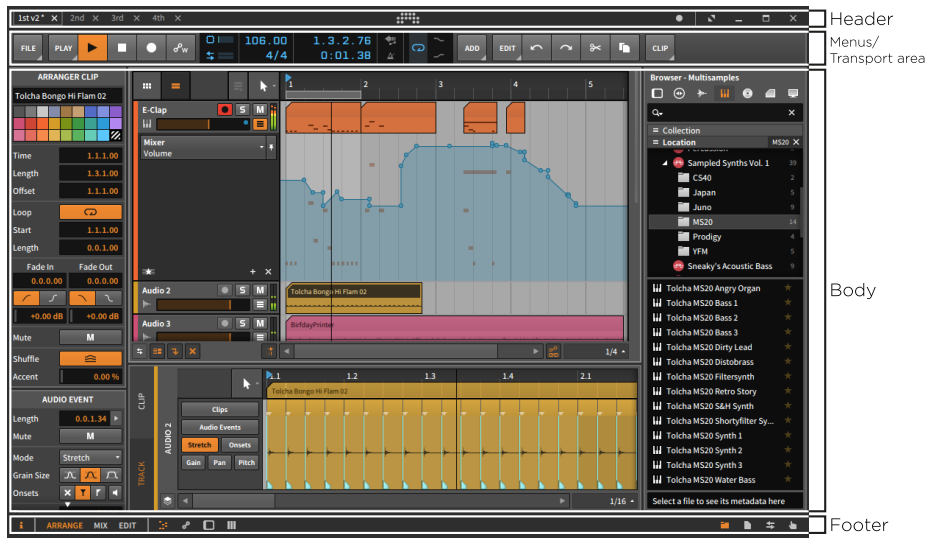

We will give them each their own turn: the reliable header, the pliant footer, the shifting menus/transport area, and finally the mercurial body.

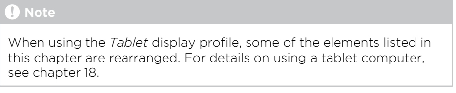

##  2.1. The Window Header

The header of each window contains two main sections: project tabs are found on the left, and window controls are found on the right.

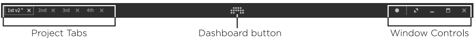

The area just to the left of the window controls is also used controller status icons, if controllers are connected and configured. Otherwise, nothing appears here.

In the center is the Dashboard button. When clicked, the Dashboard will appear over the main window. For more information on the Dashboard, see section 0.2.

It is also worth noting that by right-clicking anywhere in the window header, a context menu with display options is called up.

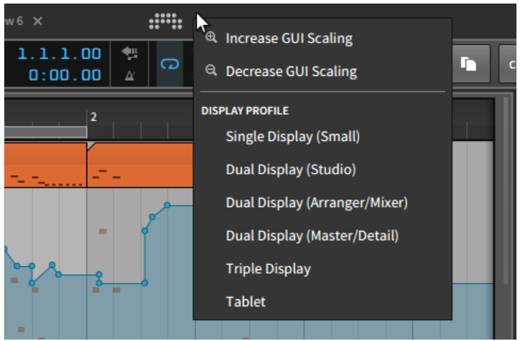

The Increase GUI Scaling and Decrease GUI Scaling options allow you to resize Bitwig Studio's entire graphical user interface to be larger or smaller (respectively) on your monitor.

| Note |
| --- |
| By default, Bitwig Studio makes maximum use of your screen. As such, the Decrease GUI Scaling option may not do anything if you try it first. |

Beneath the GUI options are a list of the available Display Profile choices (see section 1.5) for easy switching.

#  2.1.1. Project Tabs Section

On the far left are tabs for the Bitwig Studio projects which are currently open. Some notes on using these tabs:

Bitwig Studio will display the contents of only one project at a time. This is true even if you are using a display profile that uses multiple application windows.

> To focus on any one of the open projects, click on its tab.

> The tab that is outlined with a box and whose name appears in bright white represents the currently viewed project. In the image below, this is the project named 2nd.

> Only one project at a time is capable of producing sound. This allows you to view and even edit different projects without interrupting audio playback of the current one.

> You can click and drag any project tab to change its position.

> If there is not enough space to show all open projects together, left and right scroll arrows will appear around the project tabs.

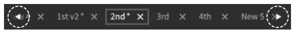

> An asterisk (*) will be appended to any project's name if unsaved changes have been made.

> The x on the right side of each tab can be clicked to close that project.

#  2.1.2. Controller Status Section

When MIDI controllers are connected and configured, the area just before the window controls section is used to display one icon per controller (within reason).

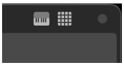

While the icons are suggestive of each device's layout — here showing one regular controller, and one pad-style controller — mousing over the icon will show the controller name.

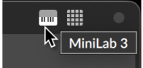

Clicking on the icon offers a status view for that controller.

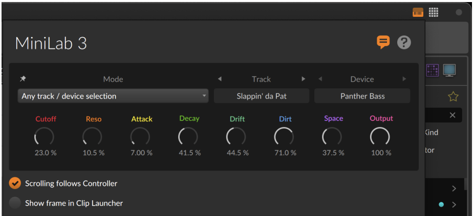

First, the icons at the top right and settings at the bottom are similar to what the Dashboard offers under Settings > Controllers (see section 0.2.2.3). The dark field in the middle offer some information and some control.

Informationally, we see exactly what this controller is currently looking at. In this case, a Device on a particular Track is being targeted, and the names and current values of the parameters in question are shown on the knobs.

Then there is this Mode menu, which determine what the controller will follow.

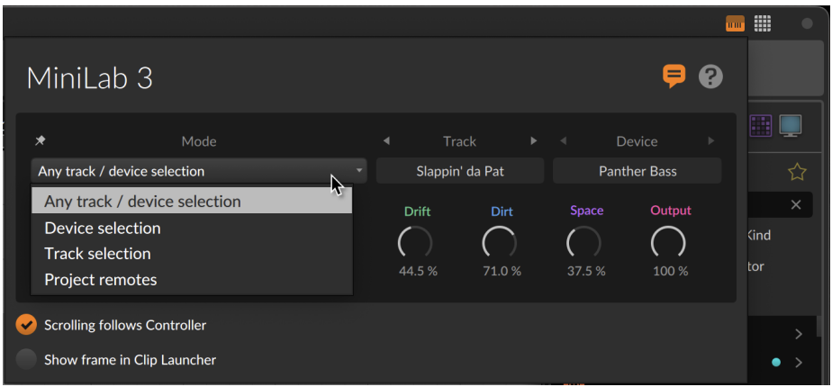

The Mode options include:

> Any track / device selection (the default setting) will focus this controller on the remote controls of any element selected in the software, including devices, tracks, and project remotes (when selecting the master track).

> Device selection will follow the remote of only devices that are selected.

> Track selection will follow the remote of only tracks that are selected.

> Project remotes will keep the controller focus on the project-level remote controls, regardless of what other project elements are clicked on.

This status page can also be used to navigate to other targets, by clicking the left and right stepper triangles around the Track and Device elements. And particular targets can also be "pinned" or locked so that they stay in focus.

Mousing over either the Track or Device element will hint at this option, showing a thumbtack icon while you hover.

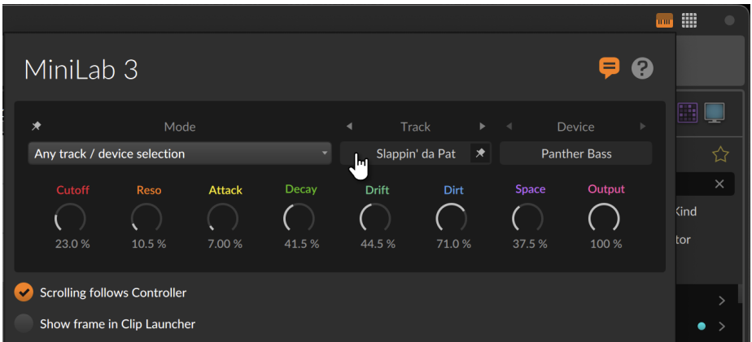

To pin a controller's focus on a particular track or device: simply click that track or device in the controller status pop-up.

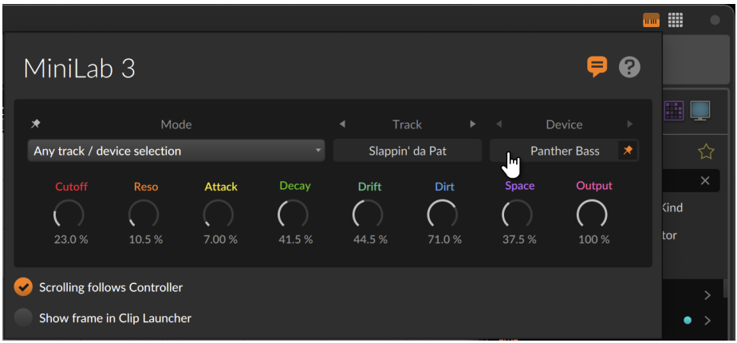

To unpin a device's focus from a particular track or device: either click the selected track or device again to toggle it off, or click to pin the controller to a different target.

#  2.1.3. Window Controls Section

##  ① Note

If your operating system has a different standard for window controls, then we try to use their preferred layout. For example on macOS, the notification toggle (shown below) will be alone in the top right corner of the window, and OS-standard close (red), minimize (yellow), and maximize (green) buttons appear on the left.

On the far right of the window header are options for controlling Bitwig Studio's window size, appearance, and notifications.

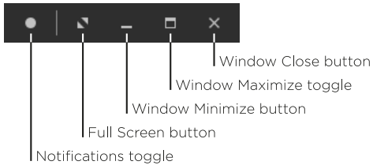

> Notification toggle allows you to show or hide event notifications from Bitwig Studio. The filled circle shown above represents that notifications are enabled, and an empty circle indicates that they will not pop up.

When notifications are enabled, any received message it will pop up below the window header.

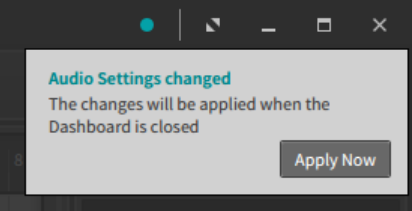

Most often, notifications are presented with an action button (such as Apply Now in the above image). Notifications tinted blue-ish are largely

assistive. Notifications tinted red represent errors that could adversely impact the performance of your project or the program itself.

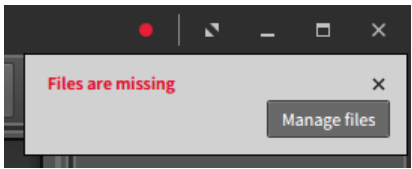

Finally, when a message is received but notifications are disabled from appearing, the ring of the empty circle icon is tinted based on the type of notification that has arrived.

> Full screen button switches Bitwig Studio into the full-screen mode provided by your operating system. Once you are in full-screen mode, the options available in the window controls section may decrease.

To exit full-screen mode: click the window maximize toggle, to the immediate left of the window close button.

> Window minimize button hides the Bitwig Studio window.

> Window maximize toggle alternates between maximizing the size of the window and restoring its original, smaller size.

> Window close button is the equivalent of quitting Bitwig Studio (by selecting File > Quit).

#  2.2. The Window Footer

The window footer contains various buttons that determine which parts of Bitwig Studio are visible, along with context-specific messages of available actions and controller visualizations.

Footers will differ based on the display profile being used. The image above — and all screenshots in this document — shows a footer from the default Single Display (Large) profile in Arrange View, where all panels and views are available.

#  2.2.1. Panel lcons

The small icons that appear in the window footer are panel icons. Each icon represents a panel that is available within the current view. The icons are also buttons, allowing you to toggle the visibility of each panel by clicking its icon. An icon that is illuminated in orange indicates an active panel.

For each cluster of icons, only one panel can be shown at a time. These icon clusters are located either on the far-left, far-right, or center-left of the window footer, indicating whether those panels would be displayed on the left, right, or center-bottom of the window, respectively.

The panel icons that you will encounter are:

i

The Inspector Panel icon is a seriffed, lowercase i. When available, you can focus on this panel and toggle its visibility by pressing [I] or [ALT]+[I].

3:3

The Detail Editor Panel icon is an arrangement of dashed lines, like a standard "piano roll" representation of notes. When available, you can focus on this panel and toggle its visibility by pressing [E] or [ALT]+[E].

∞

The Automation Editor Panel icon is two circles connected by a line, like the breakpoints that build an automation curve. When available, you can focus on this panel and toggle its visibility by pressing [A] or [ALT]+[A].

D

The Device Panel icon is a rounded rectangle with a shaded left side, like the containing box for each device and its left-sided title bar and master controls. When available, you can focus on this panel and toggle its visibility by pressing [D] or [ALT]+[D].

학

The Mixer Panel icon is a series of three wide vertical lines, like the volume faders of a mixing console. When available, you can focus on this panel and toggle its visibility by pressing [M] or [ALT]+[M].

Q

The Browser Panel icon is a folder icon, representing the library of content that is accessible in this panel. When available, you can focus on this panel and toggle its visibility by pressing [ALT]+[B].

The Project Panel icon is a file icon, representing the project file whose metadata is defined in this panel.

The Output Monitoring Panel icon is a pair of opposite-pointing arrows, representing the input and output paths that are addressed in this panel.

The Mappings Browser Panel icon is a right-hand with an extended index finger, representing the connections of yourself to your project that are made here.

The On-screen Keyboard Panel icon shows the common grouping of five piano-style keys, representing one of the note visualization and entry methods available in this panel.

#  2.2.2. View Words

The capitalized, bold words that appear on the left side of the window footer represent all currently available views. To match the views' names, the labels used are ARRANGE, MIX, and EDIT.

A window with no view words indicates that your current display profile is fixed and has only one available view.

For the two-window display profiles (those whose name begins with Dual Display), available views are shown as compound names, such as ARRANGE-MIX or MIX-EDIT. In this situation both windows show the same view words, indicating the views shown on the primary and secondary windows, respectively.

#  2.2.3. Available Actions

Available actions appear just to the right of all left-aligned view words and panel icons. As your mouse moves around the program, any interactive object that is hovered over will display information and available mouse functions here.

| SOLO Off | CLICK Toggle solo/cue | SHIFT+CLICK Toggle solo/cue (and clear all others) |
| --- | --- | --- |

In the example above, a track SOLO button is hovered so the line starts with the object name and it's status (the solo button is switched Off

currently). Possible CLICK and modifier-click options follow. And since I was holding the [SHIFT] key, the SHIFT+CLICK option is shown more brightly as it will be used.

Available actions are also shown while you are interacting with the program, as in this example when actively dragging a Launcher clip.

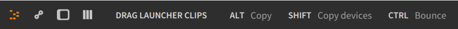

While dragging a clip, I am free to move it to a different clip slot or even to an Arranger track, but additional modifiers are also available to change the basic move action into something more complex. Available actions are there to remind us of workflow variations for tasks that we are already doing.

#  2.2.4. Parameter Information

Parameter information will appear in the same area when mousing over various controls in the program. This is most commonly seen while working with devices. In the example below, the cursor is hovering over the cutoff control of the filter in Polysynth.

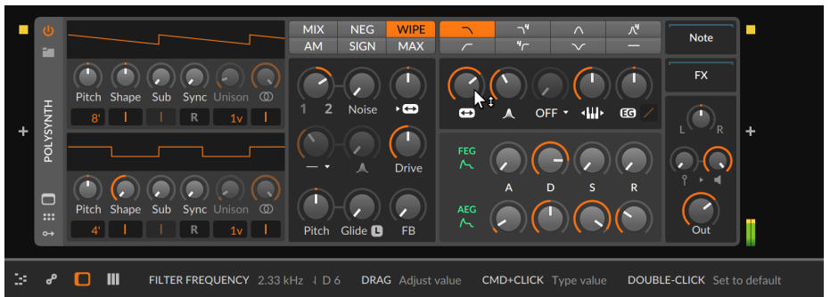

Here the footer show the full title of the parameter (Filter Frequency) and then the current parameter value (2.33 kHz).

Since this happens to be a frequency parameter, the following string shows the relevant pitch as MIDI note (4 D6). Since an arbitrary frequency rarely matches a specific note value, the tone bar before the note name signifies the intonation to the note shown:

> 1 indicates that the frequency is quite sharp.

> 1 indicates that the frequency is somewhat sharp.

> 1 indicates that the frequency is very close or in tune.

> Ⓕ indicates that the frequency is somewhat flat.

> J indicates that the frequency is quite flat.

When a parameter has modulators mapped to it, that parameter's calculated value is also shown.

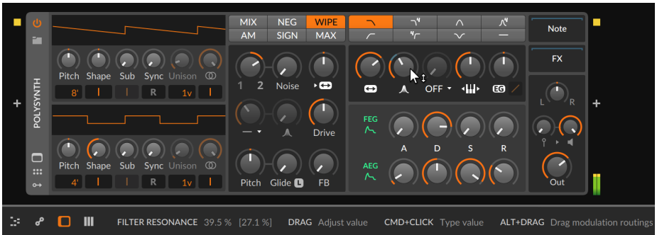

In the example above, the Filter Resonance knob position is set to 39.5 %. The following bracketed value, [27.1 %], shows the applied value of the parameter after all modulator signals are added.

#  ① Note

For information on using Bitwig's modulators to modulate any device or plug-in parameter, see section 16.2.

Additionally, parameters that consist of a list of possible settings (such as modes) often present additional information when hovered over.

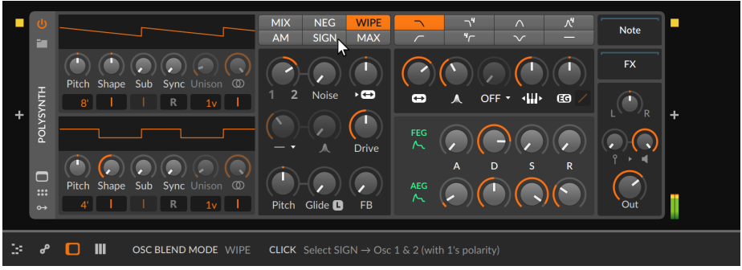

For example, the OSC Blend Mode in Polysynth presents six discrete buttons with short mode names (MIX, NEG, WIPE, etc.). As shown in the

image above, mousing over the mode S/GN provides a short explanation of what this means in the window footer.

#  2.2.5. Controller Visualizations

Controller visualizations also use the same middle portion of the footer. They show the current position of controls and the parameters that they are assigned to (for any controller that has visualizations enabled).

The layout and visual style is influenced by the controller script. And when non-immediate takeover modes (see section 0.2.2.3) are being used, the outer ring/indicator shows the current parameter value in white and the colored indicator shows the hardware control's current position. Once the parameter and control meet, both elements use the control color.

#  2.3. The Window Menus/Transport Area

Beneath the window header is an area where Bitwig Studio's menus live, along with the transport and its associated displays.

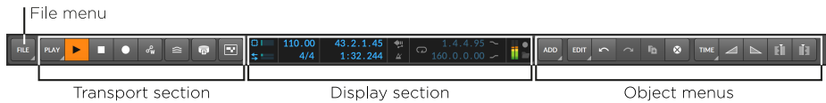

Some of these elements are persistent, and some are transitory. This is a function of Bitwig Studio's unique menu system, which we will examine first.

##  2.3.1. The Menu System (via the File Menu)

The File menu itself contains only menu items that you would expect and/or those which will be covered in this document at the appropriate time. So we will take this opportunity to see Bitwig Studio's unique menu system at work.

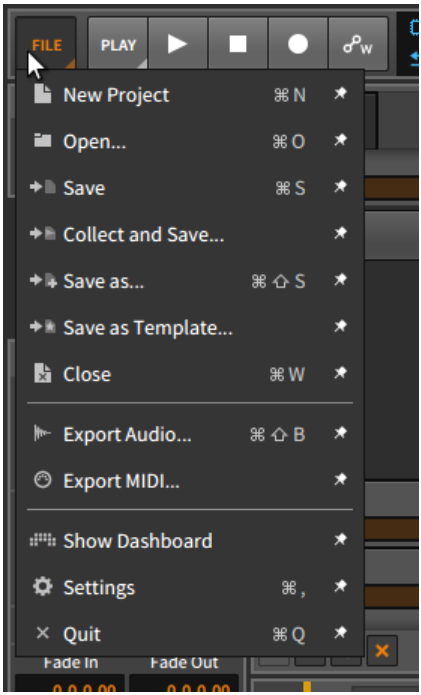

Most items in the menu shown above have four distinct elements:

> An icon leads each entry, visually abbreviating the function of the menu item.

> The menu item name itself is always second.

> When defined, a keyboard shortcut follows. When more than one keyboard shortcut exists for a menu item, the first shortcut is shown.

#  ① Note

For information on making or altering shortcut assignments, see section 0.2.2.5.

> Finally, a thumbtack toggle appears at end of each line.

To anchor an item in the menu area: enable the thumbtack toggle beside the menu item. This will place a button with the menu item's icon beside the menu button itself.

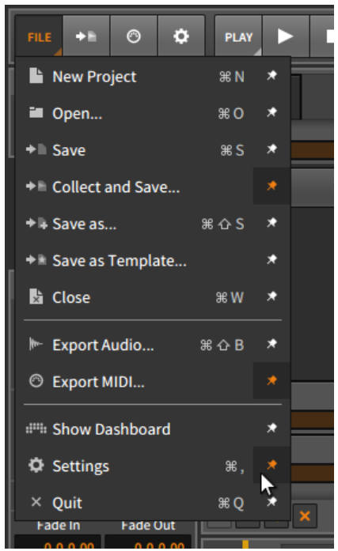

In the image above, three menu items (Collect and Save..., Export MIDI..., and Settings) each have their thumbtack toggle enabled. And now to the right of the File menu are three shortcut buttons, each representing one of those menu items and showing their menu item's icon. Clicking one of these buttons is the equivalent of triggering the menu item.

Like the File menu, each menu button is indicated with a dog-eared triangle in its bottom right corner, hinting that the button can be unfolded. Every menu in Bitwig Studio uses this system, allowing you to anchor any function that you please to the top level of the program.

#  ① Note

If your window is ever sized too narrowly to display all menu options, the program will prioritize by showing all menu buttons first, and then showing as many anchored buttons as will fit the current width.

#  2.3.2. Transport Section

The transport section appears deceptively simple at first glance.

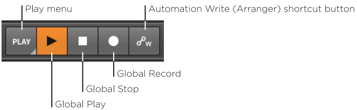

Let's skip the Play menu for the moment and look at the four buttons that follow:

> Global Play: Toggles and indicates the state of Bitwig Studio's transport. When clicked to toggle the transport on, Arranger playback resumes from the Play Start Position and active Launcher clips are triggered in sync. When clicked to toggle off, the transport is stopped and the Play Start Position is moved to the current Global Playhead position.

> Global Stop: Deactivates the transport. When the transport is already inactive, clicking the global stop button returns both the Global Playhead and the Play Start Position to the beginning (play position 1.1.1.00).

> Global Record: Arms all record-enabled tracks. When the global record button is enabled, Arranger recording will begin the next time the transport is started.

> Automation Write (Arranger) shortcut button: Enables automation recording to the Arranger Timeline the next time the transport is started.

The three global buttons above will always be present. The shortcut button, however, is so named because you can toggle it in and out of existence. This is available for many more transport options within the Play menu.

The Play menu still makes use of the thumbtack toggle convention (when appropriate), but it also makes special use of knobs and other controls. There are five headers within this menu:

> The Arranger section provides settings that apply when working within the Arranger Timeline Panel.

> The Clip Launcher section provides settings that apply when working within the Clip Launcher Panel. Note the clip boxes around the icons in this section, helping to distinguish the Launcher functions from similar Arranger functions.

> The Groove section allows you to activate shuffle for all clips whose own Shuffle parameter is enabled. Other parameters here include the Shuffle amount and interval (Rate), as well as the Accent amount, interval (again, called Rate), and Phase.

#  ① Note

All controls in the Groove section can be mapped and/or automated.

> The Playback section provides parameters that take effect during project playback, such as the Metronome volume, whether sub-beats should also sound (Play Ticks), and the mappable Fill mode toggle, used by Occurrence Operator (see section 12.1.3) and available via the Globals modulator (see section 19.28.3.3).

> The Settings section offers a mix of workflow parameters, including Pre-roll controls (for length and whether the metronome should be active), and whether you want Record Quantization applied to notes (and if so, whether you want their end times to be quantized as well).

Finally, note that Bitwig Studio's audio engine can be engaged for only one Bitwig Studio project at a time, no matter how many are open. So if your current project does not have audio enabled, the transport section will be replaced by a single button.

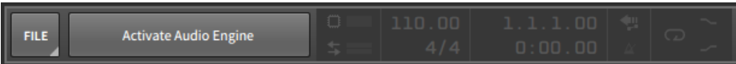

Simply click this button to rejoin the audible world. (Just realize that this will silence any other project that was previously using audio.)

#  2.3.3. Display Section

The menus/transport area's display section provides informational meters, numeric controls, and the odd automation-related setting.

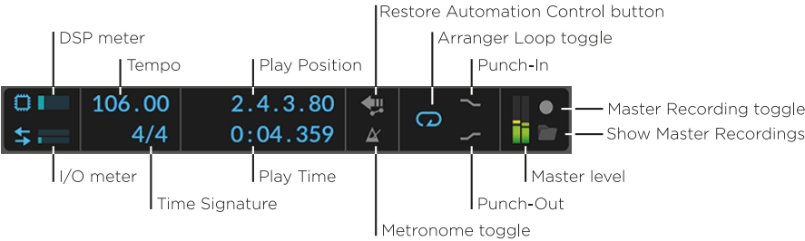

This section contains the following items:

> DSP meter: Displays Bitwig Studio's current CPU usage. (Clicking the processor chip icon on the left will also load a DSP Performance Graph window, including various details and metrics.)

> I/O meter: Displays Bitwig Studio's current disk activity for data being read (input) and written (output), respectively.

> Tempo: A control for the project's current tempo, set in beats per minute (BPM).

> Time Signature: A control for the project's current time signature and an optional tick setting.

The time signature's numerator represents the number of beats in each bar. Common denominators are accepted (such as 2, 4, 8, and 16), each number representing the type of beat counted in each bar (half, quarter, eighth, and sixteenth notes, respectively).

The optional tick setting represents the primary beat subdivision to be used across the project (see section 1.2). If only a time signature is set (like 4/4), a default tick setting of sixteenth notes is used. If the time signature is followed by a comma and an appropriate tick value (such as 4/4,8), then that tick setting will be used. Values recognized by Bitwig Studio include 8 (eighth notes), 12 (triplet eighth notes), 16 (sixteenth notes), 24 (triplet sixteenth notes), 32 (thirty-second notes), and 48 (triplet thirty-second notes).

Play Position: A control for the project's current play position, shown as BARS.BEATs.TICKS.%.

Play Time: A control for the project's current play time, shown as MINUTEs: SECONDS. MILLISECONDS.

#   Note

When a Master Recording is being made, this area shows the recording's elapsed time, shown as HOURs:MINUTEs: SECONDS (see section 14.6).

> Restore Automation Control button: Restores control of automation after a parameter is adjusted during playback. The Restore Automation Control button arms itself when the function is useful.

> Metronome toggle: Enables/disables the metronome whenever the transport is active.

> Arranger Loop toggle: Activates/deactivates Arranger looping within the Loop Selector's bounds. This toggle together with recording also

enables "cycle recording" on the Arranger for comp recording (see section 5.6.3.3).

> Punch-In: Causes recording to begin at the start of the Arranger Loop Selector.

> Punch-Out: Causes recording to stop at the end of the Arranger Loop Selector.

> Master level: Displays the current output level from the project's master track.

> Master Recording toggle: Enables/disables a Master Recording (see section 14.6).

> Show Master Recordings: When illuminated, clicking this button points the Browser Panel to the current project's master-recordings folder. (When the icon is dim, no such recordings exist.)

From the Dashboard on the Settings page, the User Interface tab has a Transport parameter that can also Show Loop Region within the display area. This displays the Arranger Loop Selector's start time and length, both to the right of Arranger Loop toggle.

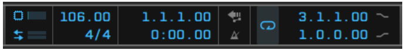

#  2.3.4. Object Menus

The far right of the window menus/transport area is reserved for the object menus.

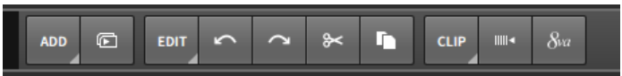

Three menus generally appear here, each with their own set of anchored items:

> The Add menu is always present. It allows you to create new tracks and scenes.

> The Edit menu is always present. It provides standard "edit" commands for your current selection (like cut, copy, paste, duplicate, and delete), as well as to undo (or redo) recent actions taken across the program.

> The third menu is a selection-sensitive menu. If nothing is selected in your Bitwig Studio project, then no menu appears here. But if you have selected, say, a Clip or Event, then a menu with relevant functions will

appear. This is essentially a context menu with the option to create shortcut buttons (using the menus' thumbtack toggles).

For example, if we made a time selection, a Time menu would be provided in the third, selection-sensitive slot.

Also note in that last image that when a function is currently unavailable, its shortcut button appears grayed out. As the menu item would appear, so will the shortcut button.

#  2.4. The Window Body

So the window header is always the same (aside from the project tabs), and while the footer's content and arrangement depend upon the current display profile, the set of controls is consistent. These two areas give you control of the program and its behavior so they are generally static. Not so with the window body.

The window body's purpose is to display your work so that you can edit it in different situations. To that end, the body's appearance is always changing, giving you the tools you need to perform specific tasks, but certain areas of the window body are designated for consistent usage.

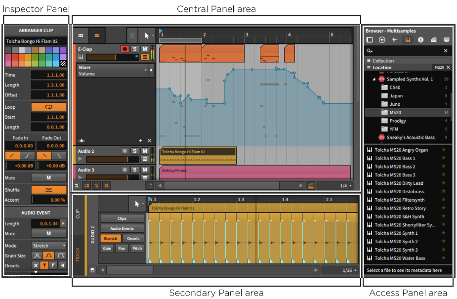

The central portion of the Bitwig Studio window is reserved for the central panel. The panel(s) shown here is defined by the window's current view (either Arrange, Mix, or Edit View). The central panel cannot be hidden, so if all other panels were disabled, the central panel would take up the entire window body.

Below the central panel is the secondary panel area. This area is where a second panel can be loaded for editing your project's content. Again, the selection of available panels is determined by the window's current view and the display profile being used. Most secondary panels can be vertically resized.

On the right side of the window body is an access panel area. This area is usually reserved for panels that deal with things other than the content of your project. Typical access panels are the Browser Panel (which gives access to the Bitwig Studio library and outside files), the Project Panel (which gives access to the project's metadata and dependencies), the Output Monitoring Panel (which gives access to your hardware routings), and the Mappings Browser Panel (which gives access to both MIDI controller mappings and project-specific computer keyboard mappings). Each of these panels can be horizontally resized. When no panel is loaded in this area, the central and secondary panels simply reclaim the space.

On the left side of the window body is an area usually reserved for the Inspector Panel. In certain display profiles, however, the Inspector Panel is included in the access panel area. This panel is not resizable.

#  3. The Arrange View and Tracks

Now that we have examined all the fixed parts and dynamic possibilities of the Bitwig Studio window, let's enter the practical world of the Arrange View. We will start by looking at a few key sections of the Arranger Timeline Panel and their constituent elements. We will then examine the track types used by Bitwig Studio along with basic track editing functions. Finally we will get a brief introduction to the Inspector Panel for current and future use.

##  3.1. The Arranger Timeline Panel

Unlike sculpture, painting, and architecture, music is an art form appreciated over a defined length of time. That is to say, when we listen to a piece of music, either at home or out at a venue, it unfolds over the same amount of time and at the same pace for everyone in the audience. While music can definitely be performed or created with improvisation (see chapter 6), each performance has a rigidly defined structure to us listeners. And as most productions are still based around a fixed song structure, we will start with the Arrange View and its friend the Arranger Timeline Panel, which is made to lay out music arrangements in a precise way.

The Arranger Timeline Panel is unique in Bitwig Studio: it is available in only one view (the Arrange View), and it is available in this view only as the central panel. And as this panel is the only way to create a traditional, linear musical arrangement within Bitwig Studio, it is impossible to overstate the importance of the Arranger Timeline Panel — also called the Arranger — which is seen here after a new file has been created.

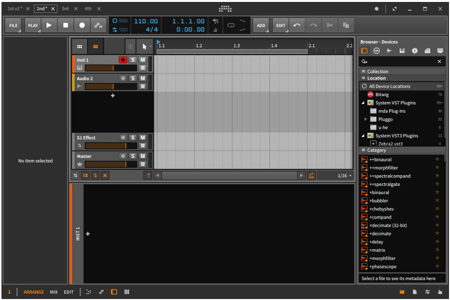

We will start by examining various sections of the Arranger Timeline Panel.

#  3.1.1. Arranger Area, Arranger Timeline, and Zooming

The most important element here is the actual Arranger Timeline, which is currently blank. As you may have seen here in earlier images (or from opening a demo project), this is the area where your song arrangements will take shape in the form of clips and track automation. Whenever we refer to an "Arranger clip," we mean a clip that is housed within this Arranger sequencer.

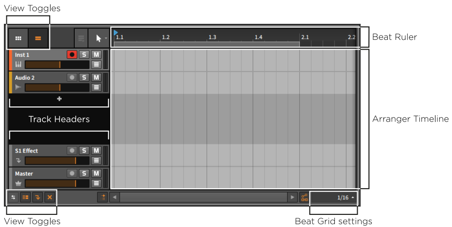

The Arranger is laid out horizontally, showing time progressing from the left side of the screen to the right. This can be seen in the Beat Ruler at the top of the Arranger. The integers here – 1, 2, 3, etc. – show where each new bar begins.

To adjust the zoom level: place the mouse in-line with the bar numbers inside the Beat Ruler. The cursor will become a magnifying glass indicating that we are in zoom mode. Now click and hold the mouse button, dragging upward to zoom in or downward to zoom out. You can also drag the mouse from side to side to horizontally scroll within the Arranger Timeline.

Other ways to adjust the zoom level include:

> Press either [PLUS] or [CTRL]+[PLUS] ([CMD]+[PLUS] on Mac) to zoom in and either [MINUS] or [CTRL]+[MINUS] ([CMD]+[MINUS] on Mac) to zoom out.

> Hold [CTRL]+[ALT], and then click and drag anywhere within the Arranger area. If your mouse or trackpad supports a scroll function, you can also hold [CTRL]+[ALT] anywhere within the Arranger area and then scroll up and down.

> If you have a three-button mouse, click and drag the middle button anywhere within the Arranger area.

> If you have a trackpad (particularly on Mac), pinch/stretch two fingers diagonally on the trackpad.

As you zoom in on the Beat Ruler, you may notice that the bar numbers start adding decimals. Depending on your zoom level, the timeline values will be represented as either BARs, BARs.BEATs, or BARs.BEATs.TICKS.

And within the Beat Ruler area, you can also right-click to show a realtime ruler, displaying MINUTES: SECONDS. MILLISECONDS of the project time.

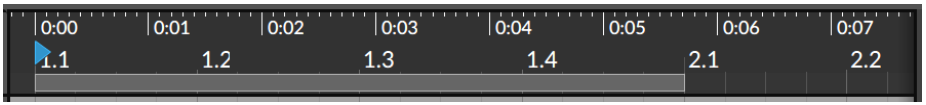

#  3.1.2. Beat Grid Settings

As you adjust the Arranger Timeline's zoom level, you may also notice that the grid lines within the Arranger area begin to change. This has to do with the beat grid settings, which are found in the bottom of the Arranger Timeline Panel and to the right of the horizontal scroll bar.

Actually, the value shown represents the current value in use. By clicking on that value, the various Grid settings are exposed.

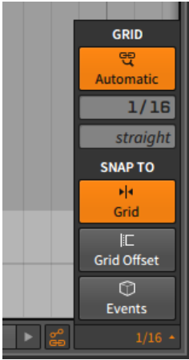

The beat grid resolution (shown above as 1/16, for sixteenth notes) tells us what musical interval is being represented by the grid lines. In a new project, the adaptive beat grid setting (the button at top, with a linked magnifying glass and the word Adaptive) is turned on. When adaptive beat grid is enabled, changes to the zoom level also cause appropriate changes to the beat grid resolution. The beat grid resolution setting will update as the value changes.

To toggle the adaptive beat grid: click the adaptive beat grid button within the beat grid settings, or press [SLASH].

#  ① Note

On a German keyboard, the key command is [HYPHEN].

To manually set the beat grid resolution: first make sure that adaptive beat grid is disabled. Then manipulate the beat grid resolution by setting it with the mouse or by pressing [COMMA] to lower the grid resolution or [PERIOD] to raise it.

The beat grid resolution has an accompanying parameter right below it. The beat grid subdivision (shown above as straight) sets the rhythmic grouping used for the beat grid resolution setting. For example, the default straight value means that straight duplex values are being used. Other available settings include triole or 3t (triplets), quintole or 5t (quintuplets, or fifth-lets), and septole or 7t (septuplets, or seventh-lets).

To manually set the beat grid subdivision: first make sure that adaptive beat grid is disabled. Then manipulate the beat grid subdivision by setting it with the mouse or by pressing [ALT]+[COMMA] to lower the grid resolution or [ALT]+[PERIOD] to raise it.

##  3.1.3. Track Headers

The horizontal lines you see within the Arrange area are the dividers between each track lane. To the left of the Arrange area are the track headers.

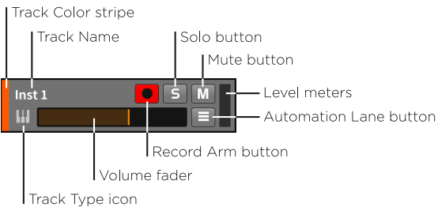

Within each header are the following identifications, meters, and controls for that track:

> Track Color stripe: A swatch of the track's assigned color.

> Track Type icon: An icon to indicate the kind of track.

> Track Name: The title assigned to the track.

> Volume fader: A final level control for the track.

> Record Arm button: Record enables the track.

> Solo button: When any track has its solo button enabled, only tracks with solo enabled will output their audio.

> Mute button: Disables the track's audio output.

> Automation Lane button: Toggles to reveal the automation lane section of the track (see section 9.1.1).

> Level meters: Stereo audio meters that display the track's output level.

#  3.1.4. Arranger View Toggles & Editing Tools

Both above and beneath the track headers are the Arranger view toggles. Similar to the panel icons of the window footer, each of these icons is a toggle that adjusts what is displayed in the Arranger Timeline Panel.

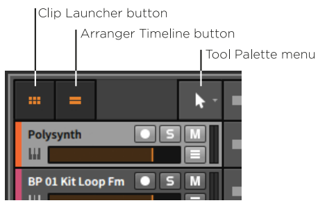

The upper toggles are:

> Clip Launcher button: Toggles visibility of the Clip Launcher Panel (see section 6.1) within the Arranger Timeline Panel.

> Arranger Timeline button: Toggles visibility of the Arranger Timeline within the Arranger Timeline Panel

##  ① Note

Either the Clip Launcher Panel or the Arranger Timeline must be visible within the Arranger Timeline Panel. If only one of these is visible and you hide it, the other will automatically become visible.

> Tool Palette menu: This menu allows you to toggle between Bitwig Studio's various editing tools.

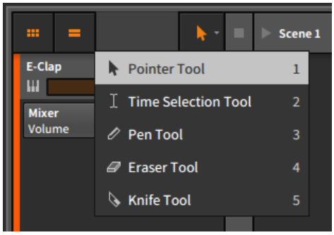

In fact, right-clicking within any timeline-based panel will give you the option to switch tools at the top of the context menu.

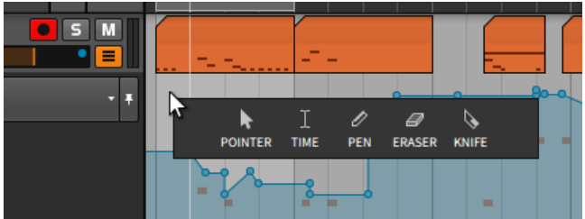

While the Arranger Timeline Panel is the first place we see the tool palette, each timeline-based panel has its own tool palette. This allows us to have a different tool selected for each individual panel.

> Pointer tool is for selecting and moving objects, such as clips, audio and note events, or automation points. Clicking in between automation points along the current curve will create a new point. And double-clicking in a blank area will create a new event of the appropriate kind. You can switch to this tool by pressing [1], or you can temporarily use the tool by holding [1].

#  ① Note

Editing functions described in this document presume you have the Pointer tool engaged. If a different tool is meant to be used, it will be specifically noted.

Time Selection tool is the other primary tool, for choosing an arbitrary section of time instead of particular events. Often when using the Pointer tool, clicking below a header (for Arranger clips or audio events) or dragging in space where no objects are present (such as empty Arranger lanes or within note clips), the Time Selection tool

is already being used. You can also explicitly switch to this tool by pressing [2], or you can temporarily use the tool by holding [2].

#  ① Note

Myriad, precise editing functions are available from the keyboard when working with either Time Selection or the Pointer tool. This includes when working with clips (see section 5.2), automation (see section 9.3), audio events (see section 10.2), and note events (see section 11.2).

> Pen tool is for drawing new events. You can switch to this tool by pressing [3], or you can temporarily use the tool by holding [3].

> Eraser tool is for deleting relevant events from the area of time that you select. You can switch to this tool by pressing [4], or you can temporarily use the tool by holding [4].

> Knife tool is for splitting a continuous event into two. You can switch to this tool by pressing [5], or you can temporarily use the tool by holding [5].

Finally, the Pointer tool engages in smart tool switching. This is to say that depending on where you hover over a clip or event, different tools will become available. Specific information will be provided within this document, but it is worth mentioning here as your cursor will tend to shift shapes as you mouse navigate around clips.

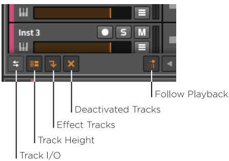

The lower toggles are:

> Track I/O button: Toggles visibility of the Track I/O section of all track headers (see section 5.6.1).

► Track Height button: Toggles the track height in the Arranger between normal and half size (shown below respectively). In half size, the same track header components are displayed with some minor adjustments.

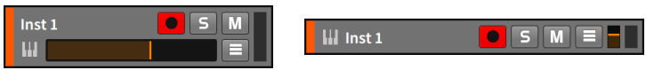

> FX Tracks button: Toggles visibility of FX tracks within the Arranger Timeline Panel.

> Deactivated Tracks button: Toggles visibility of deactivated tracks within the Arranger Timeline Panel.

> Follow Playback button: Toggles whether to keep the Global Playhead on screen at all times in the Arranger Timeline Panel or not.

| Note |
| --- |
| From the Settings tab within the Dashboard, the User Interface page offers two settings for the Playhead follow mode: |
| > Scroll by pages will scroll once the Global Playhead reaches the edge of the current display area. This is the default setting. |
| > Continuously scroll will keep the Global Playhead centered in each timeline-based panel. |

#  3.2. Intro to Tracks

As we have seen in the Arranger Timeline, Bitwig Studio projects are organized into tracks, and clips live on tracks. While clips are critical for expressing your musical ideas, tracks contain the signal paths that take clips out of the computer and into the audible world. Were there no tracks, there would be no sound either.

We will look at the kinds of tracks that exist in Bitwig Studio before discussing a few basic track operations.

##  3.2.1. Track Types

Bitwig Studio has five types of tracks. The four most common types are present in any new project you create. Here again is a blank new project.

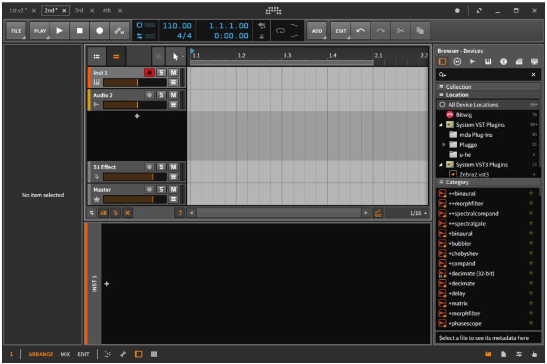

As each type of track has its own designated icon, each track also has its own particular use:

An instrument track is denoted with a piano keys icon. The usual purpose of an instrument track is to record and hold note clips that will trigger an instrument and result in audio output.

An audio track is denoted with a waveform icon. The usual purpose of an audio track is to record and hold audio clips that will be played back.

A hybrid track is denoted with an icon that is half audio waveform and half piano keys. The usual purpose of a hybrid track is to record and hold both note and audio clips. A hybrid track is not present in a new Bitwig Studio project.

An FX track is denoted with a downward arrow icon. The usual purpose of an FX track is to receive portions of other tracks' audio output, then mix them together for further processing.

A group track is denoted with a folder icon. The usual purpose of a group track is to unite several component tracks (either instrument, audio, hybrid, FX, or other group tracks) into one higher-level track for streamlined mixing and editing. The track's folder icon appears open when its component tracks

are visible and closed when they are hidden from view. A group track is not present in a new Bitwig Studio project.

A master track is denoted with a crown icon. One and only one master track is present in each project, making him the king. The purpose of the master track is to sum all signals that are routed to the main audio buss. The master track also provides access to various transport parameters (such as tempo) for the sake of automation, modulation, et cetera.

#  3.2.2. Creating and Selecting Tracks

As you develop any project, you will almost certainly need additional tracks.

To create a track: go to the Add menu and select either Add Instrument Track, Add Audio Track, Add FX Track, or Add Group Track.

Other ways to create a track include:

> Use the appropriate key command as noted in the Add menu.

> Right-click a part of the Arranger where no tracks exist (such as the blank space between the track headers), and then choose the appropriate function from the context menu.

Before you can do anything with a track, it must first be selected, and the track header is key to this. Clicking anywhere else — including in the Arranger Timeline area — selects clips or automation, not an entire track.

When a track is not selected, the background of its header is charcoal gray, and its text and icon are light. When a track is selected, the background of its header is a light silver, and its text and icon are dark.

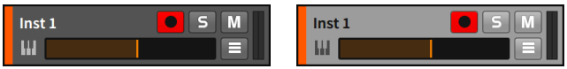

To select a track: click on the track's header.

When a track is already selected, you can press [UP ARROW] or [DOWN ARROW] to cycle thru the adjacent tracks.

To select or deselect additional contiguous tracks: either hold [SHIFT] and then click on the final track to be included in the selection, or hold [SHIFT] while cycling thru tracks with [UP ARROW] or [DOWN ARROW].

And when a track is moved around, the track number in its name is dynamically updated. By default, tracks are set to automatically name themselves based on certain factors. If you desire, you can override this functionality by renaming the track.

To rename a track: right-click the track's header and then choose Rename from the context menu.

#  3.2.5. Track Colors and Color Palettes

Each track is assigned a color when it is created. Like the track name, the track color can also be changed.

To change the color of a track: right-click the track's header and then select a different color from the palette that appears within the context menu.

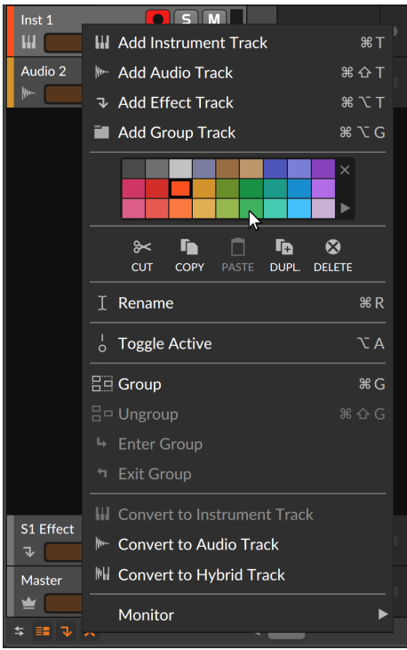

To the right of the color palette are two additional options. Clicking the x icon clears the color from the current object, opting instead to 'inherit' the color provided. And clicking the right-facing triangle in the bottom corner exposes a menu of factory and user color palettes.

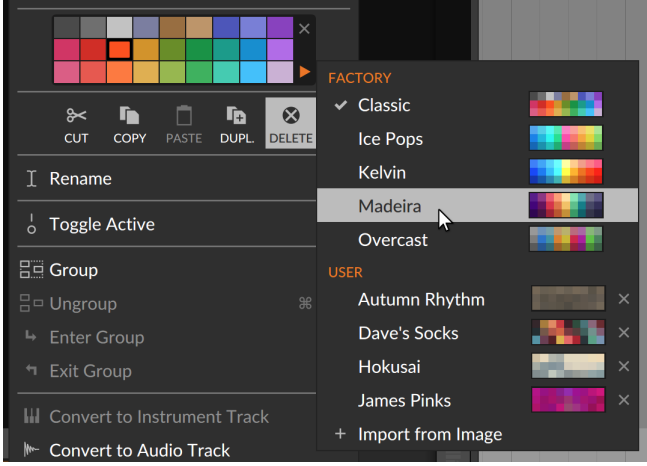

Selecting a different palette makes those colors available, and the most recent palette will be remembered while working on this project. To add a new palette of your own to the User category, simply drag a PNG or JPG file from your system's file manager onto the Bitwig window. The image will be resampled and reviewed for you.

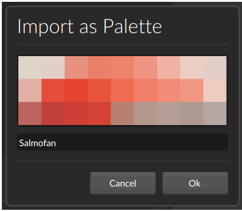

Change the name as necessary and click Ok to add this palette to your library.

#  3.2.6. Deactivating Tracks

There are various ways to silence a track. One useful option is to deactivate and subsequently (re)activate tracks. When a track is deactivated, not only is its output silenced, but any load it was placing on your CPU is also removed for the time being. From the standpoint of our limited computing resources, deactivating an object is as close as we can get to deleting it — and none of our data are lost in the process.

To deactivate an active track: right-click the track's header and then choose Activate/Deactivate Track from the context menu. Or select the track and then press [ALT]+[A].

Any disabled track is visibly grayed out and certain interface items are removed.

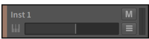

To activate an inactive track: right-click the track's header and then choose Activate/Deactivate Track from the context menu. Or select the track and then press [ALT]+[A].

#  ① Note

The deactivate and (re)activate functions can be applied to tracks, devices, and top-level chains/layers of the Drum Machine, Instrument Layer, and FX Layer container devices. And any plug-ins that are deactivated will also stop accruing latency to your project.

Similarly, clips and notes can be muted and unmuted with the same respective key commands.

#  3.3. Meet Inspector Panel

A context menu is available across Bitwig Studio. By right-clicking on an item (practically any object or event), relevant actions that can be taken will be shown along with certain properties of that item. For a fuller list of the available properties, we also have the Inspector Panel.

To toggle the visibility of the Inspector Panel: click the view toggle for the Inspector Panel (the $i$ icon), located in the window's footer.

The Inspector Panel follows the active panel's selection, displaying all properties of that selection. As there are many types of items in Bitwig Studio (clips, notes, audio events, devices, automation points, and tracks), the parameters displayed in the Inspector Panel can change dramatically depending on what you have clicked on.

By selecting a track, the Inspector Panel displays relevant parameters of that track.

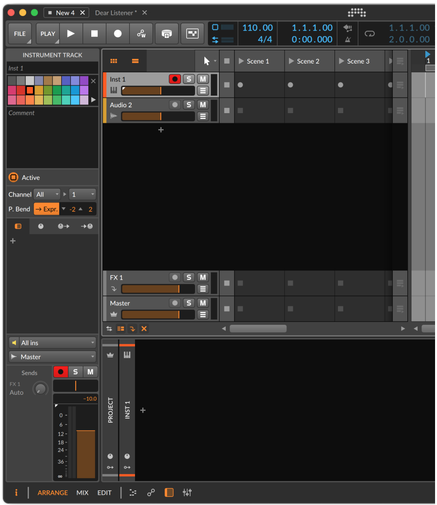

The text entry box at top displays the current track name (shown in italics when the name is provided by Bitwig Studio). The color palette is identical to the one from the track header context menu, a Comment can be left for viewing here or in the mixer interfaces, and the Active toggle controls whether the selected track is currently running or deactivated.

Plenty of other parameters are shown within the Inspector Panel, including nearly all of the meters and controls from the track header. And we will get to the parameters that are now unfamiliar in the appropriate sections of this document.

The main idea is that the Inspector Panel is an ideal way to see all the parameters of most selected items. A context menu is also available for most items and window areas. Going forward, we will primarily use the Inspector Panel for viewing or altering parameters and the context menu for executing functions. So this isn't "goodbye" to either option, but rather "nice to meet you."

#  4. Browsers in Bitwig Studio

In some ways, the best analogy for a digital audio workstation is a traffic cop. A primary task of the modern DAW is getting your computer and software to play well with everyone, including any controllers, plug-ins, and audio equipment you may have. The hardware side of this is a bit more obvious and flashy — working with MPE controllers and their fluid note streams; offering our controller API for dynamic and customized interactions between hardware and software; multitouch support, including alternate workflows for editing, mixing, and performing; various playback sync options; specialized display profiles for two or three monitor setups; and natively speaking control voltage (CV) for Eurorack modules and beyond.

While the software side might seem like the easier part of the equation, it includes all of your files. And the list of file formats you might browse is only growing. As of today, it includes: WAV, AIFF, MP3, FLAC, OGG, OPUS audio files (and more); WT wavetable files; MULTISAMPLE, SFZ, and SoundFont 2 (SF2) multisample files; CLAP, VST 2, and even VST3 plug-ins; BWPRESETS, H2P, as well as FXP, FXB, VSTPRESET, and any vendor-specific formats that CLAP preset discovery offers; BWIMPULSE files and any other audio for use as convolution impulse files; BWCLIP files, MIDI files, DAWPROJECT files (for project interchange with other music programs; more information here [https://www.bitwig.com/support/technical_support/dawproject-file-format-faqs-62/]), and other sequence formats with some import support (FLP and ALS), as well as BWPROJECT and BWTEMPLATE files; and Bitwig's internal devices, modulators, and modules.

The purpose of Bitwig Studio's browsers is to connect your current idea to a relevant musical materials from that mountain of files and formats. This means providing clear ways to narrow a large pile of results, and also nudging you back on track when you might be looking for something in the wrong place. And as with any search, you will find a great sound at the wrong time so making it easy to file things away for later is important too. In short, it's better to save time each day, both for today and tomorrow.

We say "browsers" plural because there is the omnipresent Browser Panel anchored to the right side of the window, as well as the dynamic Pop-up Browser that appears when a plus icon (+) or folder button is clicked. Their structures are largely identical, and their few differences will be noted.

One procedural note: key commands will be mentioned all thru this chapter, and they reference Bitwig's Default keyboard mappings. If you are working with your own key commands, most functions can be found and mapped as you like (see section 0.2.2.5).

So let's dive into browsing. We'll generally look at features in isolation — sources, filters, key commands, autocomplete suggestions, customization options, and more — but when working on music, you will use these tools together. Which is great because then you'll spend less time selecting sounds and more time bringing them to life.

#  4.1. All Sources

Browsing in Bitwig Studio is centered around sources. Each source is just a way to group searchable content, providing windows thru which you can approach your files. When any browser is loaded, a source is selected.

In the Browser Panel, the current source is shown by the title above the various filters. In this image, Samples + Clips is the selected source.

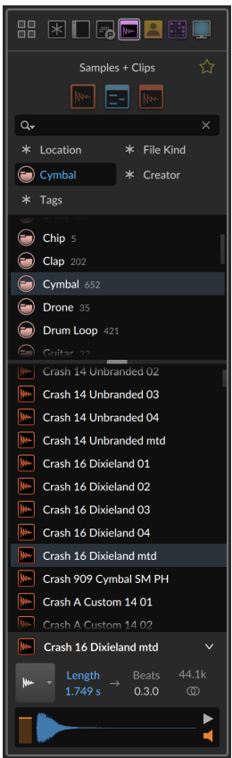

And in any variation of the Pop-up Browser, the area above the filters also shows the current source along with its icon. Shown here is the All

Instruments source and its keyboard icon, hinting that note input will be required.

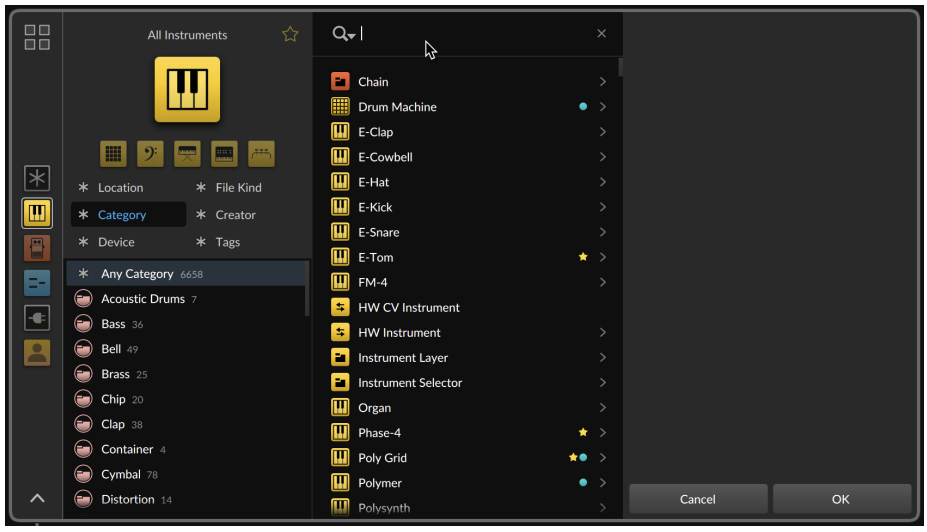

In both of these views, the top left corner holds a button (with an icon of four little squares) for switching to the All Sources page, where all available sources can be seen. Clicking on any source returns to the browser with that source selected, so every available source can be browsed from the All Sources page. Or press [CTL]+[0] ([CMD]+[0] on Mac) to toggle between the All Sources page and the regular browser view.

We will look at each of the four tabs in order. And for now we will use the perspective of the Browser Panel, where having no context means that everything is always available.

Just know that each source only appears once, so knowing the concept of each tab will help you know where to look later.

#  4.1.1. Packages Tab

The Packages tab offers a source for each sound package you have from Bitwig, as well as a way to acquire content you haven't installed yet.

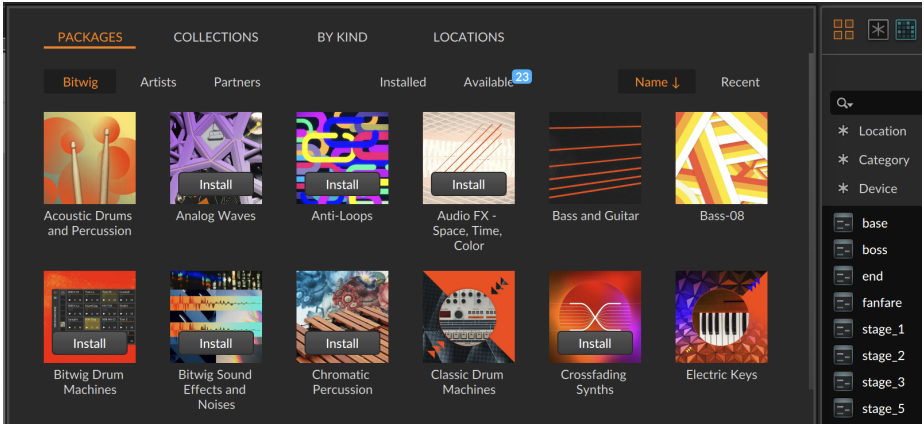

Unique to the Packages tab is a row of view and sort options, all shown as small text buttons just above where the packages start. They are identical to those in the Packages tab of the Dashboard (see section 0.2.3).

#  4.1.2. Collections Tab

The Collections tab displays all user-saved groups. This definitely includes Favorites, which contains every item you have marked as a favorite. And any fixed collections (with the colorful grid icons) of yours will be here too, as well as dynamic smart collections (with the magnifying glass icons) that you might have created.

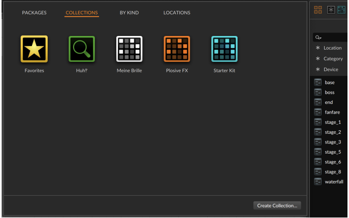

Right-clicking on any collection or smart collection provides a context menu with various options, including to change the color of its icon or to Delete Collection.

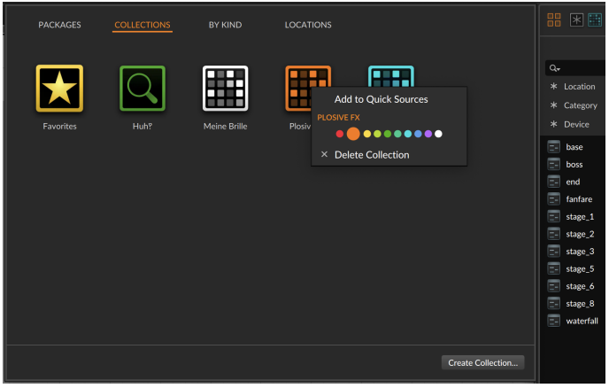

To rename a collection or smart collection: click on its name, which will make the text editable.

Both collections and smart collections are ways for you to organize your content. But contrary to their names being so similar, they represent two distinct concepts.

A collection starts empty and waits for you to insert content into it. In this way, the Favorites source is a special collection. For some users, this single collection will be enough, but you can create others.

To create a collection from the All Sources page: on the Collections tab, click the Create Collection... button in the bottom right corner of the window. Then choose a name and color for the collection.

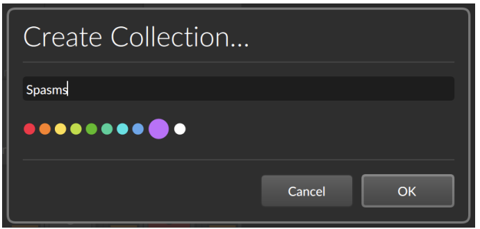

Items can be added to the collection either from the results list (see section 4.2.3), from the file area (see section 4.2.4), or from the Quick Sources (see section 4.3.1).

A smart collection is a saved set of filters that can be viewed as a source. As it doesn't contain individual items but rather search parameters, its content will be dynamic (see section 4.3.4).

#  4.1.3. by Kind Tab

The by Kind tab offers sources organized by file type — and sometimes by category as well. Since these sources are always available, this list is the longest to start with.

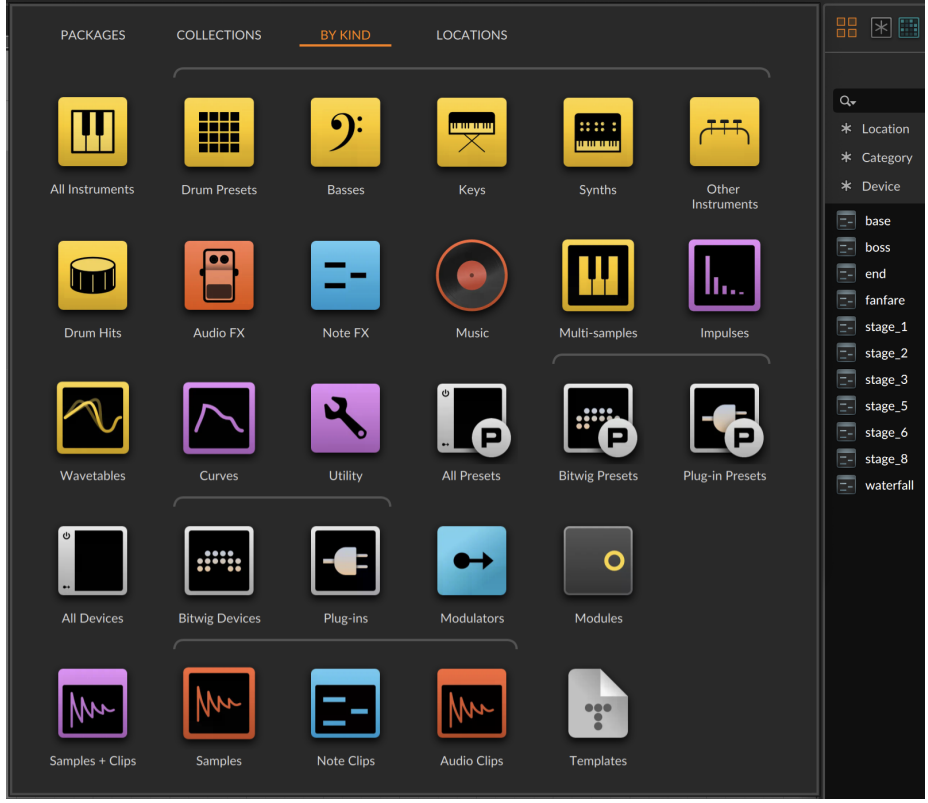

All Instruments contains all instrument devices, plug-ins, and presets. It is the parent source of these individual sound-descriptive sources:

> Drum Presets contains devices, plug-ins, and presets in known drum/percussion categories (including Clap, Cymbal, Drum Kit, Hi-hat, Kick, Percussion, Snare, and Tom).

> Basses contains devices, plug-ins, and presets in known bass categories (including Bass and Synth Bass).

> Keys contains devices, plug-ins, and presets in known keyboard categories (including Electric Piano, Organ, and Piano).

